# Reporte - Práctica 7: ASP Clásico - Operaciones CRUD con Bases de Datos (OLEDB Directo)

---

**ASIGNATURA:**  
Desarrollo de Aplicaciones Web

**DOCENTE:**  
EUGENIA ERICA VERA CERVANTES

**ALUMNO:**  
MONTEALEGRE NAHUACATL OSVALDO 

**FECHA DE ENTREGA:**  
Lunes, 22 de junio de 2026

---

## Introducción

Se presentan 12 ejemplos de ASP Clásico en VBScript que implementan las operaciones CRUD (Create, Read, Update, Delete) sobre una base de datos Microsoft Access (.accdb) utilizando exclusivamente **conexión directa OLEDB** con el proveedor `Microsoft.ACE.OLEDB.12.0`, sin dependencia de DSN. Los ejemplos abarcan desde la lectura básica de registros hasta inserción, modificación, eliminación, búsqueda por filtros, ordenamiento y conteo de registros.

El objetivo principal es demostrar el manejo completo de datos desde ASP Clásico mediante ADODB con conexión OLEDB directa, incluyendo la resolución de problemas comunes como la discrepancia de tipos de datos entre la base de datos y las consultas SQL.

---

## Entorno y requisitos

Para visualizar y ejecutar correctamente los archivos de esta práctica se requiere lo siguiente:

- **Sistema operativo:** Windows 10/11 o Windows Server con IIS (Internet Information Services) instalado y habilitado.
- **IIS con ASP Clásico:** El rol de servidor web debe tener habilitado ASP (Active Server Pages) en las características de IIS.
- **Microsoft Access Database Engine 32-bit:** Necesario para la conexión con archivos `.accdb`. El proveedor `Microsoft.ACE.OLEDB.12.0` requiere la versión de 32 bits del motor de base de datos de Access.
- **Application Pool configurado:** El pool de aplicaciones de IIS debe tener habilitado `enable32BitAppOnWin64=true`, `managedRuntimeVersion=""` y `managedPipelineMode=Classic` para compatibilidad con el proveedor ACE OLEDB de 32 bits.
- **Navegador web:** Cualquier navegador moderno (Chrome, Edge, Firefox) para solicitar las páginas ASP a través de HTTP.
- **Ubicación de los archivos:** Los archivos `.asp` y la carpeta `Base_Datos/` deben colocarse en el directorio del sitio web.
- **Permisos:** El directorio del sitio debe tener permisos de lectura para el usuario `IUSR` (IIS Anonymous User). La carpeta `Base_Datos/` requiere permisos de lectura y escritura para las operaciones de inserción, modificación y eliminación.
- **Editor de código:** Recomendable usar un editor como VS Code, Notepad++ o Bloc de notas para revisar y modificar el código fuente.

---

## Configuración del Application Pool de IIS

Para que los ejemplos funcionen correctamente, es necesario configurar el application pool de IIS de la siguiente manera:

1. Abra el **Administrador de IIS**.
2. En el panel de **Grupos de aplicaciones**, localice o cree un pool (ej. `Practica7Pool`).
3. Configure las siguientes propiedades:

| Propiedad | Valor | Descripción |
|---|---|---|
| `enable32BitAppOnWin64` | `true` | Permite ejecutar procesos de 32 bits para usar el proveedor ACE OLEDB |
| `managedRuntimeVersion` | `""` (vacío) | Elimina la carga del runtime .NET, ya que solo se usa Classic ASP |
| `managedPipelineMode` | `Classic` | Modo Classic para compatibilidad con ISAPI de ASP clásico |
| Identity | `NetworkService` | Identidad del pool para acceso a recursos |

**Comandos equivalentes (appcmd.exe):**
```
appcmd set apppool Practica7Pool /enable32BitAppOnWin64:true
appcmd set apppool Practica7Pool /managedRuntimeVersion:""
appcmd set apppool Practica7Pool /managedPipelineMode:Classic
```

---

## Problemas encontrados y soluciones

Durante la ejecución de los programas se detectaron los siguientes problemas:

### Problema 1: Application Pool detenido (Error 503)

**Síntoma:** El navegador mostraba **503 Service Unavailable** al acceder a cualquier página ASP.

**Causa:** El application pool se caía porque estaba configurado para 64 bits pero el proveedor ACE OLEDB requiere 32 bits (cuando Office está instalado en 64 bits y se instala el motor ACE 32 bits por separado).

**Solución:** Se reconfiguró el pool para ejecutarse en modo 32 bits, sin runtime .NET y en modo Classic.

### Problema 2: Proveedor ACE OLEDB no encontrado

**Síntoma:** Error `ADODB.Connection error '800a0e7a'` — "No se encontró el proveedor especificado".

**Causa:** Office 2016 estaba instalado en 64 bits y el proveedor ACE OLEDB 32 bits no estaba registrado.

**Solución:** Se descargó e instaló el **Microsoft Access Database Engine 2016 Redistributable (32-bit)** desde el sitio oficial de Microsoft.

### Problema 3: Discrepancia de tipos de datos en columna DNI

**Síntoma:** Error `No coinciden los tipos de datos en la expresión de criterios` al ejecutar consultas `UPDATE` y `DELETE` con `WHERE DNI = 'valor'`.

**Causa:** La columna `DNI` en la base de datos Access está definida como tipo **Numérico (Long Integer)**, no como Texto. Las consultas SQL utilizaban comillas alrededor del valor (`WHERE DNI = '123840'`), lo que causaba un error de coincidencia de tipos en la cláusula WHERE.

**Solución:** Se eliminaron las comillas en los valores de DNI en las cláusulas WHERE y VALUES, cambiando `WHERE DNI = '123840'` a `WHERE DNI = 123840`.

---

## Archivos de la práctica

La práctica contiene los siguientes archivos:

| Archivo | Lenguaje | Descripción |
|---|---|---|
| `ejem_1.asp` | VBScript | Listado completo de alumnos (SELECT) |
| `ejem_2.asp` | JScript | Listado completo de alumnos con JScript (SELECT) |
| `ejem_3.asp` | VBScript | Insertar alumno con valores fijos (INSERT) |
| `ejem_4.asp` | VBScript | Actualizar apellido por DNI (UPDATE) |
| `ejem_5.asp` | VBScript | Eliminar alumno por DNI (DELETE) |
| `ejem_6.asp` | VBScript | Buscar alumno por DNI (SELECT con WHERE) |
| `ejem_7.asp` | VBScript | Listado ordenado por nombre (ORDER BY) |
| `ejem_8.asp` | VBScript | Formulario para insertar alumno (INSERT con POST) |
| `ejem_9.asp` | VBScript | Contar total de registros (COUNT) |
| `ejem_10.asp` | VBScript | Búsqueda por letra inicial (LIKE) |
| `ejem_11.asp` | VBScript | Formulario para actualizar alumno por DNI (UPDATE con POST) |
| `ejem_12.asp` | VBScript | Formulario para eliminar alumno con confirmación (DELETE con POST) |

---

## Ejecución

Para ejecutar los ejemplos de esta práctica siga estos pasos:

1. Asegúrese de que IIS esté instalado y en ejecución en su equipo Windows.
2. Copie todos los archivos de la práctica al directorio del sitio web (`C:\inetpub\wwwroot\App_web\Practica_7\`).
3. Verifique que el application pool esté configurado correctamente (ver sección anterior).
4. Verifique que el Microsoft Access Database Engine 32-bit esté instalado.
5. Abra un navegador web y acceda a la siguiente URL para cada ejemplo:
    - `http://localhost/App_web/Practica_7/ejem_1.asp`
    - `http://localhost/App_web/Practica_7/ejem_2.asp`
    - ... hasta `ejem_12.asp`
6. Para los ejemplos 8, 10, 11 y 12, utilice los formularios incluidos en cada página para interactuar.

---

## Ejemplo 1: Listado completo de alumnos

**Archivo:** `ejem_1.asp`

Este ejemplo conecta a la base de datos mediante OLEDB directo y ejecuta una consulta `SELECT * FROM Datos_Alumnos`. Muestra los campos `Nombre`, `Apellido` y `DNI` en una tabla HTML.

```asp
<%@ Language="VBScript" %>
<% Option Explicit %>
<!DOCTYPE html>
<html lang="es">
<head>
    <meta charset="UTF-8">
    <title>Listado de una tabla a través de SQL</title>
</head>
<body>
<%
    Dim Obj_Conn, Obj_RS, SQL

    Set Obj_Conn = Server.CreateObject("ADODB.Connection")
    Set Obj_RS = Server.CreateObject("ADODB.RecordSet")

    SQL = "SELECT * FROM Datos_Alumnos"

    Obj_Conn.Open "Provider=Microsoft.ACE.OLEDB.12.0;Data Source=" & Server.MapPath("Base_Datos/Alumnos.accdb")

    Obj_RS.Open SQL, Obj_Conn, 3, 3

    If Obj_RS.EOF Then
        Response.Write "<CENTER><H1>NO EXISTEN REGISTROS</H1></CENTER>"
    Else
%>
        <TABLE BORDER="1" ALIGN="CENTER">
            <TR>
                <TH>Nombre</TH>
                <TH>Apellidos</TH>
                <TH>D.N.I</TH>
            </TR>
            <% Do While Not Obj_RS.EOF %>
                <TR>
                    <TD><%= Obj_RS("Nombre") %></TD>
                    <TD><%= Obj_RS("Apellido") %></TD>
                    <TD><%= Obj_RS("DNI") %></TD>
                </TR>
            <% 
                Obj_RS.MoveNext
            Loop 
            %>
        </TABLE>
<%
    End If

    Obj_RS.Close
    Obj_Conn.Close
    Set Obj_RS = Nothing
    Set Obj_Conn = Nothing
%>
</body>
</html>
```

**Explicación del código:**

| Elemento | Descripción |
|---|---|
| `Server.CreateObject("ADODB.Connection")` | Crea el objeto de conexión ADODB. |
| `Server.CreateObject("ADODB.RecordSet")` | Crea el objeto Recordset para almacenar resultados. |
| `Provider=Microsoft.ACE.OLEDB.12.0` | Proveedor OLEDB para bases de datos Access 2007+ (.accdb). |
| `Server.MapPath("Base_Datos/Alumnos.accdb")` | Convierte la ruta virtual a física. |
| `Do While Not Obj_RS.EOF ... Loop` | Itera sobre todos los registros devueltos. |
| `Obj_RS("Nombre")` | Obtiene el valor del campo especificado del registro actual. |

---

## Ejemplo 2: Listado completo con JScript

**Archivo:** `ejem_2.asp`

Este ejemplo es funcionalmente equivalente al anterior, pero utiliza **JScript** como lenguaje de scripting en lugar de VBScript. Se declara con `<%@ LANGUAGE="JScript" %>`.

```asp
<%@ LANGUAGE=JScript %>
<!DOCTYPE html>
<html lang="es">
<head>
    <meta charset="UTF-8">
    <title>Ejemplo ASP con ADO y JScript</title>
</head>
<body>
<%
    var Ob_Conn = new ActiveXObject("ADODB.Connection");
    var Ob_RS = new ActiveXObject("ADODB.RecordSet");

    var ruta = Server.MapPath("Base_Datos/Alumnos.accdb");
    Ob_Conn.Open("Provider=Microsoft.ACE.OLEDB.12.0;Data Source=" + ruta);

    var Sql = "SELECT * FROM Datos_Alumnos";
    Ob_RS.Open(Sql, Ob_Conn, 3, 3);
%>

<center>
<table border="1">
    <tr>
        <th>D.N.I.</th>
        <th>Nombre</th>
        <th>Apellido</th>
    </tr>

<%
    while (!Ob_RS.Eof) {
%>
    <tr>
        <td><%= Ob_RS("DNI") %></td>
        <td><%= Ob_RS("Nombre") %></td>
        <td><%= Ob_RS("Apellido") %></td>
    </tr>
<%
        Ob_RS.MoveNext();
    }

    Ob_RS.Close();
    Ob_Conn.Close();
%>
</table>
</center>

</body>
</html>
```

**Particularidades de JScript en ASP:**

| Elemento | Descripción |
|---|---|
| `<%@ LANGUAGE="JScript" %>` | Cambia el lenguaje de scripting por defecto a JScript. |
| `var` | Declaración de variables al estilo JavaScript. |
| `new ActiveXObject("ADODB.Connection")` | Creación de objetos COM con `new`. |
| `while (!Ob_RS.Eof)` | Bucle condicional con sintaxis de JScript. |
| `Ob_RS.MoveNext()` | Los métodos usan paréntesis en JScript. |

---

## Ejemplo 3: Insertar alumno con valores fijos

**Archivo:** `ejem_3.asp`

Este ejemplo inserta un registro en la tabla `Datos_Alumnos` con valores fijos, sin formulario de entrada. Utiliza una consulta SQL `INSERT` ejecutada con `Connection.Execute()`.

```asp
<%@ Language="VBScript" %>
<% Option Explicit %>
<!DOCTYPE html>
<html lang="es">
<head>
    <meta charset="UTF-8">
    <title>Insertar alumno (INSERT)</title>
</head>
<body>
<%
    Dim Obj_Conn, SQL

    Set Obj_Conn = Server.CreateObject("ADODB.Connection")
    Obj_Conn.Open "Provider=Microsoft.ACE.OLEDB.12.0;Data Source=" & Server.MapPath("Base_Datos/Alumnos.accdb")

    SQL = "INSERT INTO Datos_Alumnos (Nombre, Apellido, DNI) VALUES ('Carlos', 'Lopez', 558877)"
    Obj_Conn.Execute(SQL)

    Response.Write "<h3>Alumno insertado correctamente.</h3>"
    Response.Write "<a href='ejem_1.asp'>Ver listado completo</a>"

    Obj_Conn.Close
    Set Obj_Conn = Nothing
%>
</body>
</html>
```

**Explicación del código:**

| Elemento | Descripción |
|---|---|
| `INSERT INTO Datos_Alumnos ... VALUES (...)` | Sentencia SQL para insertar un nuevo registro. |
| `Obj_Conn.Execute(SQL)` | Ejecuta la sentencia SQL directamente sin Recordset. |
| `'Carlos', 'Lopez'` | Valores de texto entre comillas simples. |
| `558877` | Valor numérico sin comillas (DNI es campo numérico). |

**Nota:** El valor de `DNI` se especifica sin comillas porque la columna es de tipo numérico en la base de datos.

---

## Ejemplo 4: Actualizar apellido por DNI

**Archivo:** `ejem_4.asp`

Este ejemplo actualiza el apellido de un alumno localizado por su DNI, utilizando una consulta SQL `UPDATE` con valores fijos.

```asp
<%@ Language="VBScript" %>
<% Option Explicit %>
<!DOCTYPE html>
<html lang="es">
<head>
    <meta charset="UTF-8">
    <title>Actualizar alumno (UPDATE)</title>
</head>
<body>
<%
    Dim Obj_Conn, SQL

    Set Obj_Conn = Server.CreateObject("ADODB.Connection")
    Obj_Conn.Open "Provider=Microsoft.ACE.OLEDB.12.0;Data Source=" & Server.MapPath("Base_Datos/Alumnos.accdb")

    SQL = "UPDATE Datos_Alumnos SET Apellido = 'Martinez' WHERE DNI = 123840"
    Obj_Conn.Execute(SQL)

    Response.Write "<h3>Alumno actualizado correctamente.</h3>"
    Response.Write "<a href='ejem_1.asp'>Ver listado completo</a>"

    Obj_Conn.Close
    Set Obj_Conn = Nothing
%>
</body>
</html>
```

**Explicación del código:**

| Elemento | Descripción |
|---|---|
| `UPDATE Datos_Alumnos SET ... WHERE ...` | Sentencia SQL para modificar registros existentes. |
| `Apellido = 'Martinez'` | Asigna un nuevo valor de texto al campo Apellido. |
| `WHERE DNI = 123840` | Filtra por DNI (numérico, sin comillas). |
| `Obj_Conn.Execute(SQL)` | Ejecuta la actualización directamente. |

---

## Ejemplo 5: Eliminar alumno por DNI

**Archivo:** `ejem_5.asp`

Este ejemplo elimina un registro de la tabla localizado por su DNI, utilizando una consulta SQL `DELETE` con valor fijo.

```asp
<%@ Language="VBScript" %>
<% Option Explicit %>
<!DOCTYPE html>
<html lang="es">
<head>
    <meta charset="UTF-8">
    <title>Eliminar alumno (DELETE)</title>
</head>
<body>
<%
    Dim Obj_Conn, SQL

    Set Obj_Conn = Server.CreateObject("ADODB.Connection")
    Obj_Conn.Open "Provider=Microsoft.ACE.OLEDB.12.0;Data Source=" & Server.MapPath("Base_Datos/Alumnos.accdb")

    SQL = "DELETE FROM Datos_Alumnos WHERE DNI = 558877"
    Obj_Conn.Execute(SQL)

    Response.Write "<h3>Alumno eliminado correctamente (si existia).</h3>"
    Response.Write "<a href='ejem_1.asp'>Ver listado completo</a>"

    Obj_Conn.Close
    Set Obj_Conn = Nothing
%>
</body>
</html>
```

**Explicación del código:**

| Elemento | Descripción |
|---|---|
| `DELETE FROM Datos_Alumnos WHERE ...` | Sentencia SQL para eliminar registros. |
| `WHERE DNI = 558877` | Filtra por DNI (numérico, sin comillas). |
| `Obj_Conn.Execute(SQL)` | Ejecuta la eliminación directamente. |

---

## Ejemplo 6: Buscar alumno por DNI

**Archivo:** `ejem_6.asp`

Este ejemplo busca y muestra un alumno específico por su DNI. Utiliza una consulta SQL `SELECT` con cláusula `WHERE` y un DNI fijo.

```asp
<%@ Language="VBScript" %>
<% Option Explicit %>
<!DOCTYPE html>
<html lang="es">
<head>
    <meta charset="UTF-8">
    <title>Buscar alumno por DNI</title>
</head>
<body>
<%
    Dim Obj_Conn, Obj_RS, SQL, dniBuscar

    dniBuscar = "459202"

    Set Obj_Conn = Server.CreateObject("ADODB.Connection")
    Set Obj_RS = Server.CreateObject("ADODB.RecordSet")

    Obj_Conn.Open "Provider=Microsoft.ACE.OLEDB.12.0;Data Source=" & Server.MapPath("Base_Datos/Alumnos.accdb")

    SQL = "SELECT * FROM Datos_Alumnos WHERE DNI = " & dniBuscar
    Obj_RS.Open SQL, Obj_Conn, 3, 3

    If Obj_RS.EOF Then
        Response.Write "<h3>No se encontro alumno con DNI: " & dniBuscar & "</h3>"
    Else
        Response.Write "<h3>Alumno encontrado:</h3>"
        Response.Write "<table border='1'>"
        Response.Write "<tr><th>Nombre</th><th>Apellido</th><th>DNI</th></tr>"
        Do While Not Obj_RS.EOF
            Response.Write "<tr>"
            Response.Write "<td>" & Obj_RS("Nombre") & "</td>"
            Response.Write "<td>" & Obj_RS("Apellido") & "</td>"
            Response.Write "<td>" & Obj_RS("DNI") & "</td>"
            Response.Write "</tr>"
            Obj_RS.MoveNext
        Loop
        Response.Write "</table>"
    End If

    Obj_RS.Close
    Obj_Conn.Close
    Set Obj_RS = Nothing
    Set Obj_Conn = Nothing
%>
<br>
<a href='ejem_1.asp'>Ver listado completo</a>
</body>
</html>
```

**Explicación del código:**

| Elemento | Descripción |
|---|---|
| `SELECT ... WHERE DNI = " & dniBuscar` | Consulta filtrada con valor numérico sin comillas. |
| `Obj_RS.Open SQL, Obj_Conn, 3, 3` | Abre el recordset con la consulta SQL. |
| `adOpenStatic = 3, adLockOptimistic = 3` | Cursor estático con bloqueo optimista. |
| `If Obj_RS.EOF Then` | Verifica si existen resultados. |

---

## Ejemplo 7: Listado ordenado por nombre

**Archivo:** `ejem_7.asp`

Este ejemplo muestra los registros ordenados alfabéticamente por el campo `Nombre` utilizando la cláusula SQL `ORDER BY`.

```asp
<%@ Language="VBScript" %>
<% Option Explicit %>
<!DOCTYPE html>
<html lang="es">
<head>
    <meta charset="UTF-8">
    <title>Listado ordenado por nombre (ORDER BY)</title>
</head>
<body>
    <h2>Alumnos ordenados por Nombre</h2>
<%
    Dim Obj_Conn, Obj_RS, SQL

    Set Obj_Conn = Server.CreateObject("ADODB.Connection")
    Set Obj_RS = Server.CreateObject("ADODB.RecordSet")

    Obj_Conn.Open "Provider=Microsoft.ACE.OLEDB.12.0;Data Source=" & Server.MapPath("Base_Datos/Alumnos.accdb")

    SQL = "SELECT * FROM Datos_Alumnos ORDER BY Nombre ASC"
    Obj_RS.Open SQL, Obj_Conn, 3, 3

    If Not Obj_RS.EOF Then
%>
        <table border="1">
            <tr>
                <th>Nombre</th>
                <th>Apellido</th>
                <th>DNI</th>
            </tr>
<%      Do While Not Obj_RS.EOF %>
            <tr>
                <td><%= Obj_RS("Nombre") %></td>
                <td><%= Obj_RS("Apellido") %></td>
                <td><%= Obj_RS("DNI") %></td>
            </tr>
<%          Obj_RS.MoveNext
        Loop %>
        </table>
<%  Else
        Response.Write "<p>No hay registros.</p>"
    End If

    Obj_RS.Close
    Obj_Conn.Close
    Set Obj_RS = Nothing
    Set Obj_Conn = Nothing
%>
</body>
</html>
```

**Explicación del código:**

| Elemento | Descripción |
|---|---|
| `ORDER BY Nombre ASC` | Ordena los resultados alfabéticamente ascendente por Nombre. |
| `ASC` | Ascendente (A-Z). También se puede usar `DESC` para descendente. |
| `Do While Not Obj_RS.EOF` | Itera sobre los registros ordenados. |

---

## Ejemplo 8: Formulario para insertar alumno

**Archivo:** `ejem_8.asp`

Este ejemplo presenta un formulario HTML donde el usuario ingresa nombre, apellido y DNI, y al enviarlo inserta un nuevo registro en la base de datos mediante una consulta `INSERT`.

```asp
<%@ Language="VBScript" %>
<% Option Explicit %>
<!DOCTYPE html>
<html lang="es">
<head>
    <meta charset="UTF-8">
    <title>Formulario de insercion (POST)</title>
</head>
<body>
    <h2>Insertar nuevo alumno</h2>
    <form method="post" action="ejem_8.asp">
        Nombre: <input type="text" name="txtNombre"><br>
        Apellido: <input type="text" name="txtApellido"><br>
        DNI: <input type="text" name="txtDNI"><br>
        <input type="submit" value="Insertar">
    </form>
<%
    If Request.ServerVariables("REQUEST_METHOD") = "POST" Then
        Dim Obj_Conn, SQL, nombre, apellido, dni

        nombre = Request.Form("txtNombre")
        apellido = Request.Form("txtApellido")
        dni = Request.Form("txtDNI")

        If nombre <> "" And apellido <> "" And dni <> "" Then
            Set Obj_Conn = Server.CreateObject("ADODB.Connection")
            Obj_Conn.Open "Provider=Microsoft.ACE.OLEDB.12.0;Data Source=" & Server.MapPath("Base_Datos/Alumnos.accdb")

            SQL = "INSERT INTO Datos_Alumnos (Nombre, Apellido, DNI) VALUES ('" & nombre & "', '" & apellido & "', " & dni & ")"
            Obj_Conn.Execute(SQL)

            Response.Write "<p style='color:green;'>Alumno insertado correctamente.</p>"

            Obj_Conn.Close
            Set Obj_Conn = Nothing
        Else
            Response.Write "<p style='color:red;'>Todos los campos son obligatorios.</p>"
        End If
    End If
%>
<br><a href='ejem_1.asp'>Ver listado completo</a>
</body>
</html>
```

**Explicación del código:**

| Elemento | Descripción |
|---|---|
| `Request.ServerVariables("REQUEST_METHOD")` | Verifica si el formulario fue enviado mediante POST. |
| `Request.Form("txtNombre")` | Recupera el valor del campo del formulario. |
| `INSERT INTO ... VALUES ('" & nombre & "', ...)` | Construye dinámicamente la sentencia SQL con los valores del formulario. |
| Validación `If nombre <> ""` | Verifica que los campos no estén vacíos antes de insertar. |

---

## Ejemplo 9: Contar registros

**Archivo:** `ejem_9.asp`

Este ejemplo utiliza la función de agregación SQL `COUNT(*)` para obtener y mostrar el número total de registros en la tabla `Datos_Alumnos`.

```asp
<%@ Language="VBScript" %>
<% Option Explicit %>
<!DOCTYPE html>
<html lang="es">
<head>
    <meta charset="UTF-8">
    <title>Contar registros (COUNT)</title>
</head>
<body>
<%
    Dim Obj_Conn, Obj_RS, SQL, total

    Set Obj_Conn = Server.CreateObject("ADODB.Connection")
    Set Obj_RS = Server.CreateObject("ADODB.RecordSet")

    Obj_Conn.Open "Provider=Microsoft.ACE.OLEDB.12.0;Data Source=" & Server.MapPath("Base_Datos/Alumnos.accdb")

    SQL = "SELECT COUNT(*) AS Total FROM Datos_Alumnos"
    Obj_RS.Open SQL, Obj_Conn, 3, 3

    total = Obj_RS("Total")

    Response.Write "<h2>Total de alumnos registrados: " & total & "</h2>"

    Obj_RS.Close
    Obj_Conn.Close
    Set Obj_RS = Nothing
    Set Obj_Conn = Nothing
%>
<br><a href='ejem_1.asp'>Ver listado completo</a>
</body>
</html>
```

**Explicación del código:**

| Elemento | Descripción |
|---|---|
| `SELECT COUNT(*) AS Total` | Función de agregación que cuenta todos los registros. |
| `AS Total` | Asigna un alias al resultado para accederlo por nombre. |
| `Obj_RS("Total")` | Obtiene el valor del conteo desde el recordset. |

---

## Ejemplo 10: Búsqueda por letra inicial

**Archivo:** `ejem_10.asp`

Este ejemplo permite buscar alumnos cuyo nombre comienza con una letra específica, utilizando el operador SQL `LIKE` con el comodín `%`.

```asp
<%@ Language="VBScript" %>
<% Option Explicit %>
<!DOCTYPE html>
<html lang="es">
<head>
    <meta charset="UTF-8">
    <title>Busqueda por letra (LIKE)</title>
</head>
<body>
    <h2>Buscar alumnos cuyo nombre comienza con una letra</h2>
    <form method="get" action="ejem_10.asp">
        Letra: <input type="text" name="letra" maxlength="1" size="1">
        <input type="submit" value="Buscar">
    </form>
<%
    Dim Obj_Conn, Obj_RS, SQL, letra

    letra = Request.QueryString("letra")

    If letra <> "" Then
        Set Obj_Conn = Server.CreateObject("ADODB.Connection")
        Set Obj_RS = Server.CreateObject("ADODB.RecordSet")

        Obj_Conn.Open "Provider=Microsoft.ACE.OLEDB.12.0;Data Source=" & Server.MapPath("Base_Datos/Alumnos.accdb")

        SQL = "SELECT * FROM Datos_Alumnos WHERE Nombre LIKE '" & letra & "%'"
        Obj_RS.Open SQL, Obj_Conn, 3, 3

        If Not Obj_RS.EOF Then
%>
            <table border="1">
                <tr><th>Nombre</th><th>Apellido</th><th>DNI</th></tr>
<%          Do While Not Obj_RS.EOF %>
                <tr>
                    <td><%= Obj_RS("Nombre") %></td>
                    <td><%= Obj_RS("Apellido") %></td>
                    <td><%= Obj_RS("DNI") %></td>
                </tr>
<%              Obj_RS.MoveNext
            Loop %>
            </table>
<%      Else
            Response.Write "<p>No se encontraron alumnos con esa letra.</p>"
        End If

        Obj_RS.Close
        Obj_Conn.Close
        Set Obj_RS = Nothing
        Set Obj_Conn = Nothing
    End If
%>
<br><a href='ejem_1.asp'>Ver listado completo</a>
</body>
</html>
```

**Explicación del código:**

| Elemento | Descripción |
|---|---|
| `WHERE Nombre LIKE '" & letra & "%'"` | Operador `LIKE` con comodín `%` para búsqueda por patrón. |
| `Request.QueryString("letra")` | Lee el parámetro desde la URL (método GET). |
| `maxlength="1"` | Limita la entrada a un solo carácter en el formulario. |
| `LIKE 'J%'` | Encuentra todos los nombres que comienzan con 'J'. |

---

## Ejemplo 11: Formulario para actualizar alumno

**Archivo:** `ejem_11.asp`

Este ejemplo presenta un formulario para actualizar los datos de un alumno existente. El usuario ingresa el DNI del alumno y los nuevos valores de nombre y/o apellido.

```asp
<%@ Language="VBScript" %>
<% Option Explicit %>
<!DOCTYPE html>
<html lang="es">
<head>
    <meta charset="UTF-8">
    <title>Actualizar alumno por DNI</title>
</head>
<body>
    <h2>Actualizar datos de un alumno</h2>
    <form method="post" action="ejem_11.asp">
        DNI del alumno: <input type="text" name="txtDNI"><br>
        Nuevo nombre: <input type="text" name="txtNombre"><br>
        Nuevo apellido: <input type="text" name="txtApellido"><br>
        <input type="submit" value="Actualizar">
    </form>
<%
    If Request.ServerVariables("REQUEST_METHOD") = "POST" Then
        Dim Obj_Conn, SQL, dni, nombre, apellido

        dni = Request.Form("txtDNI")
        nombre = Request.Form("txtNombre")
        apellido = Request.Form("txtApellido")

        If dni <> "" And (nombre <> "" Or apellido <> "") Then
            Set Obj_Conn = Server.CreateObject("ADODB.Connection")
            Obj_Conn.Open "Provider=Microsoft.ACE.OLEDB.12.0;Data Source=" & Server.MapPath("Base_Datos/Alumnos.accdb")

            If nombre <> "" Then
                SQL = "UPDATE Datos_Alumnos SET Nombre = '" & nombre & "' WHERE DNI = " & dni
                Obj_Conn.Execute(SQL)
            End If

            If apellido <> "" Then
                SQL = "UPDATE Datos_Alumnos SET Apellido = '" & apellido & "' WHERE DNI = " & dni
                Obj_Conn.Execute(SQL)
            End If

            Response.Write "<p style='color:green;'>Alumno actualizado correctamente.</p>"

            Obj_Conn.Close
            Set Obj_Conn = Nothing
        Else
            Response.Write "<p style='color:red;'>Debe indicar el DNI y al menos un campo a actualizar.</p>"
        End If
    End If
%>
<br><a href='ejem_1.asp'>Ver listado completo</a>
</body>
</html>
```

**Explicación del código:**

| Elemento | Descripción |
|---|---|
| `Request.ServerVariables("REQUEST_METHOD")` | Verifica si el formulario fue enviado (POST). |
| `Request.Form("txtDNI")` | Recupera el DNI ingresado (como texto). |
| `WHERE DNI = " & dni` | Filtra por DNI usando valor numérico sin comillas. |
| `If nombre <> "" Then` | Actualiza solo si se proporcionó un nuevo nombre. |
| Dos UPDATE separados | Permite actualizar nombre, apellido o ambos de forma independiente. |

---

## Ejemplo 12: Formulario para eliminar alumno con confirmación

**Archivo:** `ejem_12.asp`

Este ejemplo permite eliminar un alumno ingresando su DNI. Incluye confirmación del lado del cliente mediante JavaScript (`confirm()`) y validación del lado del servidor.

```asp
<%@ Language="VBScript" %>
<% Option Explicit %>
<!DOCTYPE html>
<html lang="es">
<head>
    <meta charset="UTF-8">
    <title>Eliminar alumno con confirmacion</title>
</head>
<body>
    <h2>Eliminar alumno por DNI</h2>
    <form method="post" action="ejem_12.asp">
        DNI del alumno a eliminar: <input type="text" name="txtDNI">
        <input type="submit" value="Eliminar" onclick="return confirm('¿Esta seguro de eliminar este alumno?');">
    </form>
<%
    If Request.ServerVariables("REQUEST_METHOD") = "POST" Then
        Dim Obj_Conn, SQL, dni

        dni = Request.Form("txtDNI")

        If dni <> "" Then
            Set Obj_Conn = Server.CreateObject("ADODB.Connection")
            Obj_Conn.Open "Provider=Microsoft.ACE.OLEDB.12.0;Data Source=" & Server.MapPath("Base_Datos/Alumnos.accdb")

            SQL = "DELETE FROM Datos_Alumnos WHERE DNI = " & dni
            Obj_Conn.Execute(SQL)

            Response.Write "<p style='color:green;'>Alumno con DNI " & dni & " eliminado (si existia).</p>"

            Obj_Conn.Close
            Set Obj_Conn = Nothing
        Else
            Response.Write "<p style='color:red;'>Debe indicar un DNI.</p>"
        End If
    End If
%>
<br><a href='ejem_1.asp'>Ver listado completo</a>
</body>
</html>
```

**Explicación del código:**

| Elemento | Descripción |
|---|---|
| `onclick="return confirm('...')"` | Confirmación del lado del cliente con JavaScript. |
| `DELETE FROM ... WHERE DNI = " & dni` | Elimina el registro con el DNI especificado (sin comillas). |
| `If dni <> "" Then` | Validación de que se ingresó un DNI. |
| `"si existia"` | Mensaje informativo: DELETE no causa error si no encuentra el registro. |

---

## Estructura de la base de datos

**Archivo:** `Base_Datos/Alumnos.accdb`

La base de datos es un archivo de Microsoft Access que contiene la tabla `Datos_Alumnos` con los siguientes campos:

| Campo | Tipo de dato | Descripción |
|---|---|---|
| `Id` | Autonumérico | Identificador único del registro (clave primaria) |
| `Nombre` | Texto (255) | Nombre del alumno |
| `Apellido` | Texto (255) | Apellido del alumno |
| `DNI` | Numérico (Long Integer) | Documento nacional de identidad |

**Nota importante:** A diferencia de la Práctica 6, la columna `DNI` es de tipo **Numérico (Long Integer)** y la columna `Apellido` es singular (sin 's' final). La tabla no incluye los campos `Direccion` ni `Telefono`.

---

## Pruebas de ejecución

A continuación se presentan las capturas de pantalla que muestran la ejecución de los ejemplos en el navegador.

### Pantalla — Ejemplo 1: Listado completo
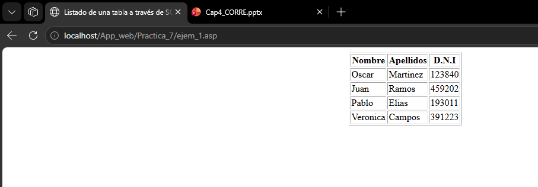

### Pantalla — Ejemplo 2: Listado con JScript
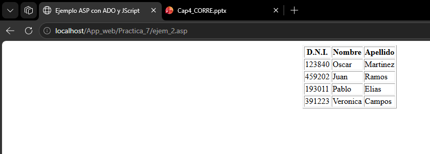

### Pantalla — Ejemplo 3: Insertar alumno
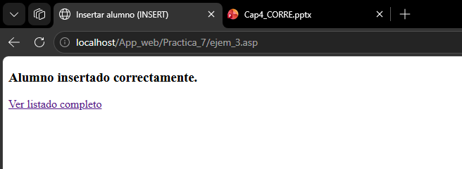
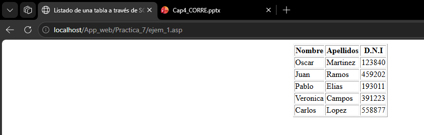

### Pantalla — Ejemplo 4: Actualizar apellido
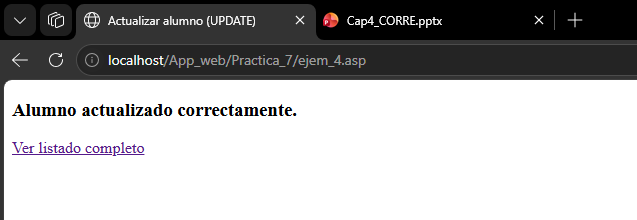


### Pantalla — Ejemplo 5: Eliminar alumno
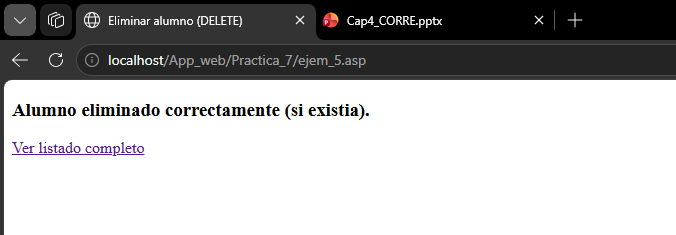


### Pantalla — Ejemplo 6: Buscar por DNI
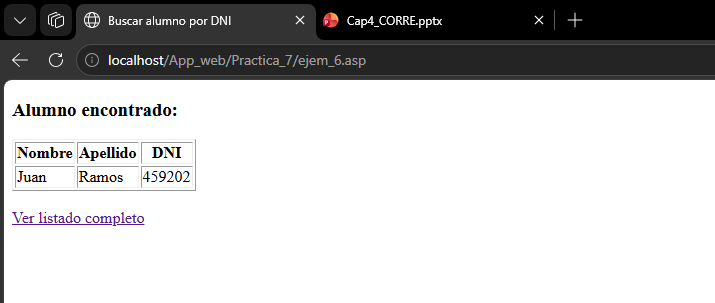


### Pantalla — Ejemplo 7: Listado ordenado
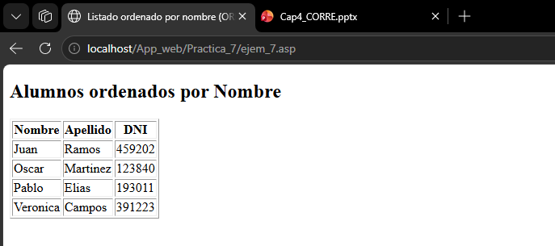

### Pantalla — Ejemplo 8: Formulario de inserción
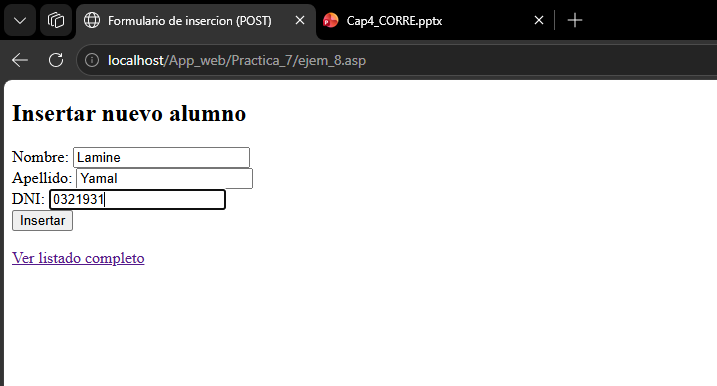
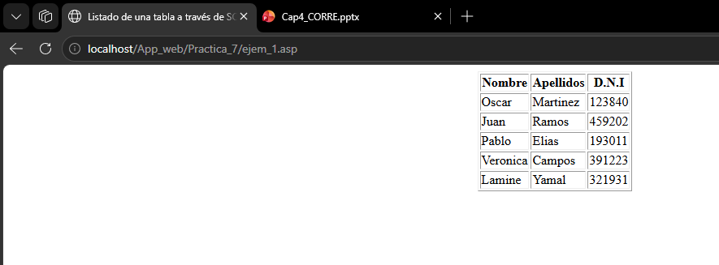

### Pantalla — Ejemplo 9: Contar registros
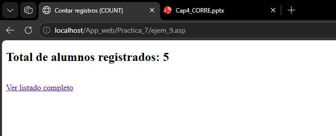


### Pantalla — Ejemplo 10: Búsqueda por letra
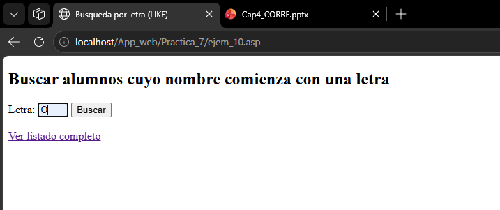

### Pantalla — Ejemplo 11: Formulario de actualización
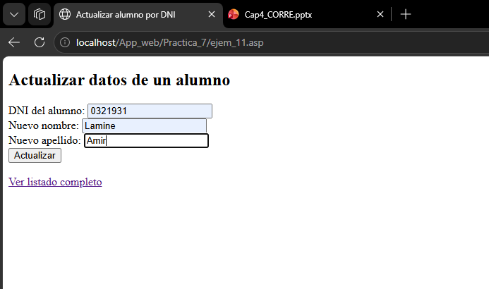
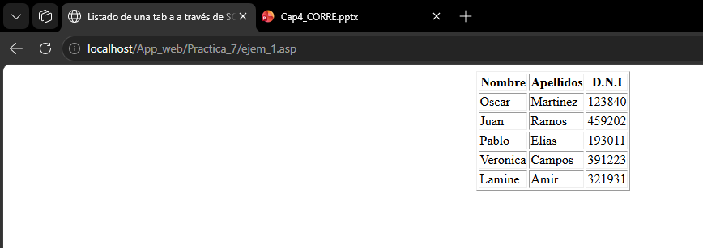

### Pantalla — Ejemplo 12: Eliminar con confirmación
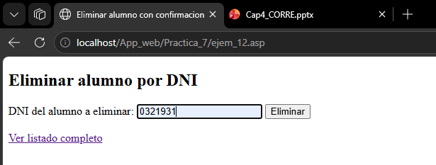
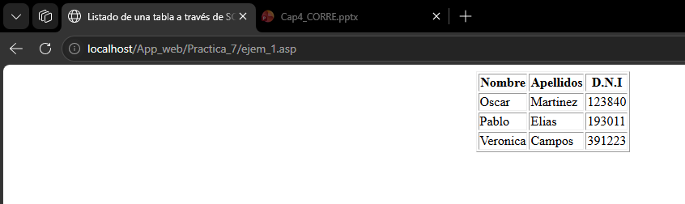

---

En esta práctica se ha demostrado cómo ASP Clásico puede implementar las cuatro operaciones fundamentales CRUD (Crear, Leer, Actualizar, Eliminar) sobre una base de datos Microsoft Access mediante ADODB con conexión OLEDB directa. Se exploraron diferentes técnicas como consultas con `WHERE`, `LIKE`, `ORDER BY` y `COUNT`, así como el uso de formularios con método POST y GET. También se documentaron y resolvieron problemas comunes como la configuración del application pool para 32 bits y la discrepancia de tipos de datos entre la base de datos y las consultas SQL. Este conjunto de ejemplos proporciona una base sólida para el desarrollo de aplicaciones web dinámicas con acceso a bases de datos desde ASP Clásico.
