# REPORTE — TU CANCHA: Sistema de Reservación de Canchas Deportivas

## 1. Datos del proyecto

- **Materia:** Desarrollo de Aplicaciones Web
- **Proyecto Final:** TU CANCHA — Sistema Web de Reservación de Canchas Deportivas
- **Equipo:** Dante Castelán Carpinteyro, María Belén Castañeda Anotzin, Osvaldo Montealegre Nahuácatl
- **Fecha:** 1 de julio de 2026
- **URL de producción:** `https://preview.castelancarpinteyro.com`

## 2. Objetivo

Desarrollar una aplicación web completa para la reservación de canchas deportivas que permita a los clientes consultar disponibilidad, reservar horarios, realizar pagos (PayPal y simulación), calificar canchas, y gestionar su perfil; y a los administradores gestionar canchas, precios, horarios, usuarios, reservaciones, reseñas, días festivos y generar reportes con gráficas estadísticas.

## 3. Entorno

- **Servidor:** Apache 2.4 con PHP 8.3.6
- **Base de datos:** MySQL 8.x (PDO con sentencias preparadas)
- **Frontend:** Bootstrap 5.3.3, Bootstrap Icons, FullCalendar 6.1.15, Chart.js 4.4.7, PayPal JS SDK
- **Librerías:** PHPMailer ^7.1 (vía Composer)
- **Conectividad SMTP:** Puerto 587 con STARTTLS, autenticación AUTH LOGIN
- **Sistema de archivos:** Linux, sin acceso root, DocumentRoot apunta a `ProyectoFinal`
- **Secrets:** Archivo `.env` (gitignored), cargado vía `config/load_env.php`

## 4. Arquitectura

El proyecto sigue una arquitectura MVC ligera sin framework:

- **Modelos:** Clases PHP en `classes/` — `Usuario`, `Cancha`, `Precio`, `Horario`, `Reservacion`, `Pago`, `PayPal`, `Resena`, `Historial`, `Mailer`
- **Vistas:** Archivos PHP en `pages/` (frontend) y `admin/` (backend), que incluyen `includes/header.php`, `navbar.php`, `footer.php`
- **Controladores:** Archivos PHP en `api/` que procesan formularios, devuelven JSON o redirigen
- **Configuración:** `config/config.php` define constantes desde el `.env`; `config/database.php` implementa un singleton PDO

```
Proyecto_final/
├── config/              # Configuración y conexión DB
│   ├── config.php       # Constantes del sistema
│   ├── database.php     # Singleton PDO
│   └── load_env.php     # Parser de .env
├── classes/             # Modelos de negocio
│   ├── Usuario.php
│   ├── Cancha.php
│   ├── Precio.php
│   ├── Horario.php
│   ├── Reservacion.php
│   ├── Pago.php
│   ├── PayPal.php
│   ├── Resena.php
│   ├── Historial.php
│   └── Mailer.php
├── api/                 # Endpoints (JSON / POST redirect)
├── pages/               # Vistas públicas
├── admin/               # Vistas administrativas
├── includes/            # Header, navbar, footer, auth_check
├── assets/
│   ├── css/
│   │   ├── style.css
│   │   └── dark-mode.css
│   └── js/
│       ├── main.js
│       └── dark-mode.js
├── database/
│   ├── schema.sql
│   ├── migrar.php
│   └── migraciones/     # Migraciones SQL versionadas
└── vendor/              # PHPMailer (Composer)
```

## 5. Esquema de base de datos

La base de datos `canchas_deportivas` consta de 11 tablas:

### 5.1 Tabla `usuarios`

Almacena la información de clientes y administradores:

```sql
CREATE TABLE usuarios (
    id INT AUTO_INCREMENT PRIMARY KEY,
    nombre VARCHAR(100) NOT NULL,
    email VARCHAR(100) NOT NULL UNIQUE,
    password VARCHAR(255) NOT NULL,
    telefono VARCHAR(20),
    foto_perfil VARCHAR(255) DEFAULT NULL,
    rol ENUM('cliente','admin') DEFAULT 'cliente',
    fecha_registro DATETIME DEFAULT CURRENT_TIMESTAMP,
    activo TINYINT(1) DEFAULT 1,
    ultimo_acceso DATETIME DEFAULT NULL,
    solicitud_eliminacion DATETIME DEFAULT NULL
) ENGINE=InnoDB DEFAULT CHARSET=utf8mb4;
```

### 5.2 Tabla `canchas`

Catálogo de canchas:

```sql
CREATE TABLE canchas (
    id INT AUTO_INCREMENT PRIMARY KEY,
    nombre VARCHAR(100) NOT NULL,
    tipo VARCHAR(50) NOT NULL,
    descripcion TEXT,
    precio_por_hora DECIMAL(10,2) NOT NULL,
    capacidad INT DEFAULT 10,
    imagen VARCHAR(255),
    estado ENUM('disponible','mantenimiento','inactivo') DEFAULT 'disponible',
    creada_en DATETIME DEFAULT CURRENT_TIMESTAMP
) ENGINE=InnoDB DEFAULT CHARSET=utf8mb4;
```

### 5.3 Tabla `precios`

Precios diferenciados por tipo (`regular`, `pico`, `finde`) con ventanas de día y hora:

```sql
CREATE TABLE precios (
    id INT AUTO_INCREMENT PRIMARY KEY,
    cancha_id INT NOT NULL,
    tipo_precio ENUM('regular','pico','finde') NOT NULL DEFAULT 'regular',
    nombre VARCHAR(100) NOT NULL,
    precio DECIMAL(10,2) NOT NULL,
    dia_semana_inicio TINYINT,
    dia_semana_fin TINYINT,
    hora_inicio TIME,
    hora_fin TIME,
    fecha_inicio DATE,
    fecha_fin DATE,
    activo TINYINT(1) DEFAULT 1,
    FOREIGN KEY (cancha_id) REFERENCES canchas(id) ON DELETE CASCADE
) ENGINE=InnoDB DEFAULT CHARSET=utf8mb4;
```

### 5.4 Tabla `horarios`

Bloques de tiempo disponibles por cancha y día de semana:

```sql
CREATE TABLE horarios (
    id INT AUTO_INCREMENT PRIMARY KEY,
    cancha_id INT NOT NULL,
    dia_semana TINYINT NOT NULL,
    hora_inicio TIME NOT NULL,
    hora_fin TIME NOT NULL,
    estado ENUM('disponible','no_disponible') DEFAULT 'disponible',
    FOREIGN KEY (cancha_id) REFERENCES canchas(id) ON DELETE CASCADE
) ENGINE=InnoDB DEFAULT CHARSET=utf8mb4;
```

### 5.5 Tabla `reservaciones`

Registro de cada reservación, desde pendiente hasta completada:

```sql
CREATE TABLE reservaciones (
    id INT AUTO_INCREMENT PRIMARY KEY,
    usuario_id INT NOT NULL,
    cancha_id INT NOT NULL,
    fecha DATE NOT NULL,
    hora_inicio TIME NOT NULL,
    hora_fin TIME NOT NULL,
    tipo_uso VARCHAR(50),
    estado ENUM('pendiente','confirmada','cancelada','completada') DEFAULT 'pendiente',
    total DECIMAL(10,2) NOT NULL,
    fecha_reservacion DATETIME DEFAULT CURRENT_TIMESTAMP,
    observaciones TEXT,
    recordatorio_enviado TINYINT(1) NOT NULL DEFAULT 0,
    FOREIGN KEY (usuario_id) REFERENCES usuarios(id) ON DELETE CASCADE,
    FOREIGN KEY (cancha_id) REFERENCES canchas(id) ON DELETE CASCADE
) ENGINE=InnoDB DEFAULT CHARSET=utf8mb4;
```

### 5.6 Tabla `pagos`

Cada reservación tiene exactamente un pago asociado:

```sql
CREATE TABLE pagos (
    id INT AUTO_INCREMENT PRIMARY KEY,
    reservacion_id INT NOT NULL UNIQUE,
    monto DECIMAL(10,2) NOT NULL,
    metodo_pago VARCHAR(50) DEFAULT 'tarjeta',
    estado_pago ENUM('pendiente','completado','rechazado','reembolsado') DEFAULT 'pendiente',
    referencia VARCHAR(100),
    fecha_pago DATETIME DEFAULT CURRENT_TIMESTAMP,
    FOREIGN KEY (reservacion_id) REFERENCES reservaciones(id) ON DELETE CASCADE
) ENGINE=InnoDB DEFAULT CHARSET=utf8mb4;
```

### 5.7 Tablas adicionales

- `password_resets` — Tokens de recuperación de contraseña con expiración de 1 hora
- `festivos` — Días festivos para calcular precios especiales
- `resenas` — Calificaciones 1-5 con comentario por reservación completada
- `historial` — Bitácora de actividad de usuarios
- `migraciones` — Control de versiones de esquema SQL

### 5.8 Migraciones

El sistema incluye un gestor de migraciones propio (`database/migrar.php`) que aplica archivos `.sql` en orden secuencial, registrando cada uno en la tabla `migraciones` para evitar duplicados:

```php
// database/migrar.php — Fragmento del aplicador de migraciones
$archivos = glob($dir . '/*.sql');
sort($archivos);

foreach ($archivos as $archivo) {
    $nombre = basename($archivo);
    if (in_array($nombre, $aplicadas, true)) continue;

    $sql = file_get_contents($archivo);
    $sentencias = explode(';', $sql);
    foreach ($sentencias as $sentencia) {
        $sentencia = trim($sentencia);
        if (!empty($sentencia)) {
            $db->exec($sentencia);
        }
    }
    $stmt = $db->prepare("INSERT INTO migraciones (archivo) VALUES (:archivo)");
    $stmt->execute([':archivo' => $nombre]);
}
```

## 6. Implementación de funcionalidades

### 6.1 Autenticación y registro de usuarios

El flujo de registro valida los campos, verifica que el email no exista, hashea la contraseña con `password_hash()` (bcrypt), inicia sesión automáticamente y envía un correo de bienvenida vía SMTP.

```php
// api/registro.php — Fragmento del registro
$usuarioModel = new Usuario();
$mailer = new Mailer();

if ($usuarioModel->emailExiste($email)) {
    $_SESSION['mensaje'] = 'El correo ya está registrado.';
    $_SESSION['tipo_mensaje'] = 'danger';
    header('Location: ../pages/registro.php');
    exit;
}

$id = $usuarioModel->registrar([
    'nombre' => $nombre,
    'email' => $email,
    'password' => $password,
    'telefono' => $telefono
]);

$_SESSION['usuario_id'] = $id;
$_SESSION['usuario_nombre'] = $nombre;
$_SESSION['usuario_rol'] = 'cliente';

$mailer->bienvenida($nombre, $email);
```

**Evidencia:**

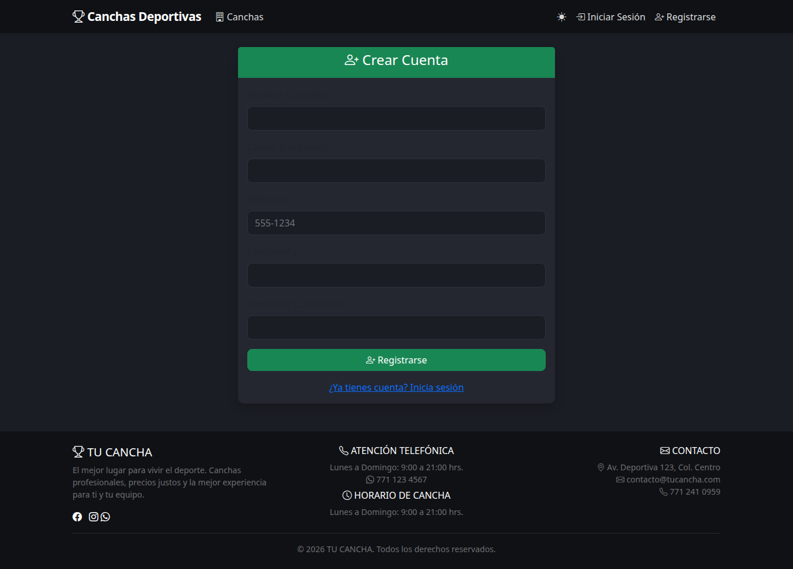

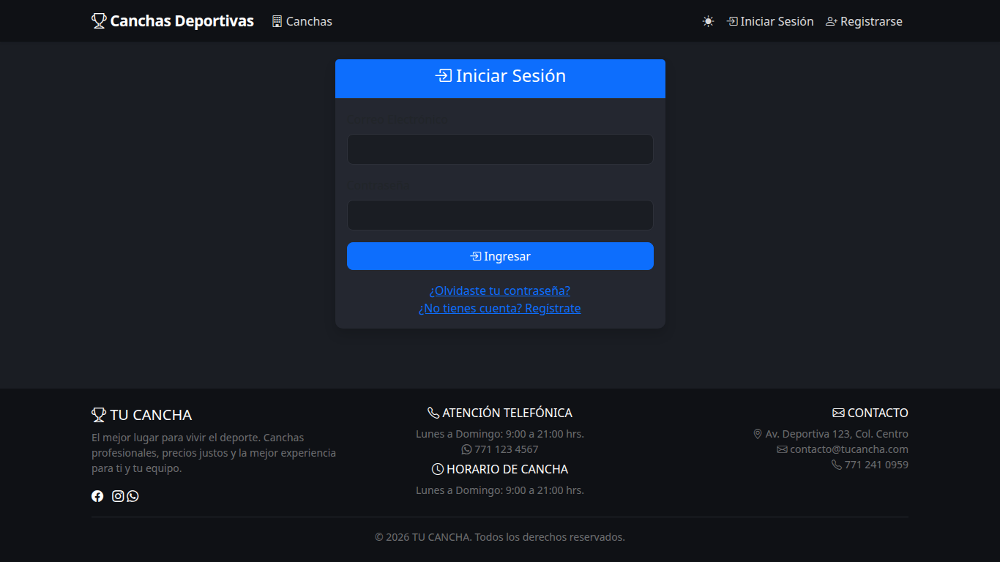

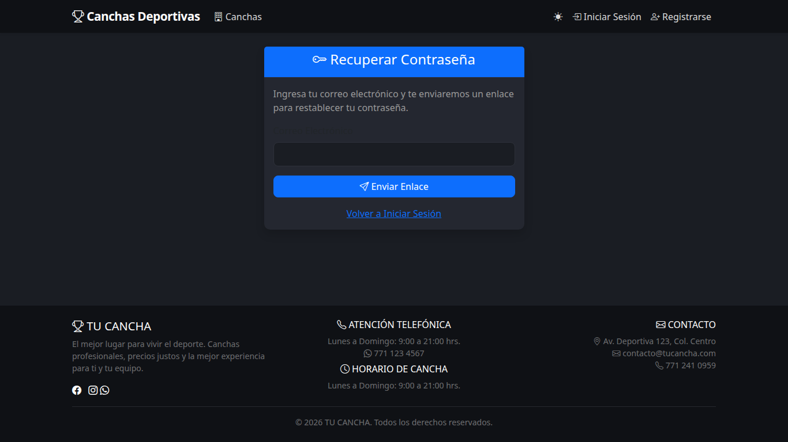

### 6.2 Catálogo de canchas con calificación

La página principal de canchas lista todas las disponibles con filtro por tipo y búsqueda por nombre. Cada tarjeta muestra el promedio de reseñas obtenido mediante `Resena::promedioPorCancha()`:

```php
// pages/canchas.php — Fragmento de la vista de canchas
$prom = $resenaModel->promedioPorCancha($cancha['id']);

<?php if ($prom['total'] > 0): ?>
<div class="mt-1">
    <?php for ($i = 1; $i <= 5; $i++): ?>
        <i class="bi bi-star<?php echo $i <= round($prom['promedio']) ? '-fill text-warning' : ''; ?>"></i>
    <?php endfor; ?>
    <small class="text-muted ms-1">(<?php echo $prom['total']; ?>)</small>
</div>
<?php endif; ?>
```

**Evidencia:**

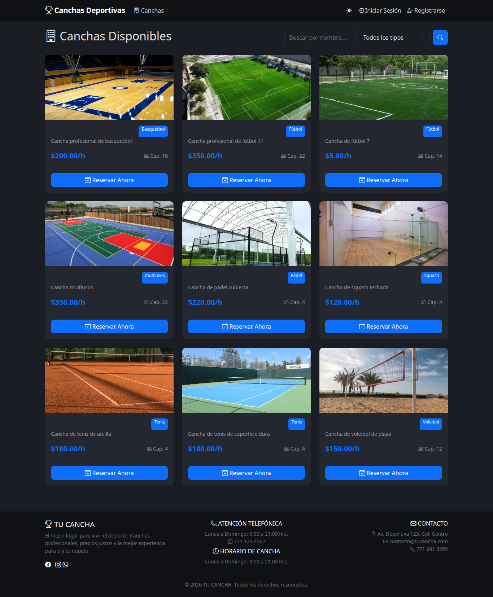

### 6.3 Reservación con FullCalendar

La página de reservar integra FullCalendar para visualizar la disponibilidad mensual y una lista de horarios disponibles para el día seleccionado. La disponibilidad se consulta mediante `Horario::obtenerConDisponibilidad()`, que hace un `LEFT JOIN` contra las reservaciones existentes:

```php
// classes/Horario.php — Consulta de disponibilidad
public function obtenerConDisponibilidad($canchaId, $fecha)
{
    $diaSemana = (int)date('N', strtotime($fecha));
    $sql = "SELECT h.*,
            CASE WHEN r.id IS NOT NULL THEN 1 ELSE 0 END as ocupado
            FROM horarios h
            LEFT JOIN reservaciones r ON r.cancha_id = h.cancha_id
                AND r.fecha = :fecha
                AND r.hora_inicio < h.hora_fin
                AND r.hora_fin > h.hora_inicio
                AND r.estado IN ('pendiente', 'confirmada')
            WHERE h.cancha_id = :cancha_id
              AND h.dia_semana = :dia_semana
              AND h.estado = 'disponible'
            ORDER BY h.hora_inicio";
    // ...
}
```

**Evidencia:**


### 6.4 Pagos con PayPal y métodos simulados

La página de pago ofrece dos modalidades: **PayPal Smart Buttons** (vía JS SDK + backend cURL REST) y métodos simulados (transferencia/efectivo). El flujo PayPal:

1. El frontend crea una orden via `api/paypal_create_order.php`
2. El backend genera un `access_token` OAuth2 y crea la orden en PayPal
3. El usuario aprueba en la ventana de PayPal
4. El frontend captura via `api/paypal_capture_order.php`
5. El backend captura la orden, actualiza la BD y envía confirmación por correo

```php
// classes/PayPal.php — Creación de orden PayPal
public function createOrder($monto, $moneda = 'MXN', $referencia = '')
{
    $accessToken = $this->getAccessToken();
    $url = $this->baseUrl . '/v2/checkout/orders';

    $payload = [
        'intent' => 'CAPTURE',
        'purchase_units' => [[
            'reference_id' => $referencia,
            'amount' => [
                'currency_code' => $moneda,
                'value' => number_format($monto, 2, '.', '')
            ]
        ]]
    ];

    $ch = curl_init($url);
    curl_setopt_array($ch, [
        CURLOPT_RETURNTRANSFER => true,
        CURLOPT_POST => true,
        CURLOPT_POSTFIELDS => json_encode($payload),
        CURLOPT_HTTPHEADER => [
            'Content-Type: application/json',
            'Authorization: Bearer ' . $accessToken
        ]
    ]);
    $response = curl_exec($ch);
    return json_decode($response, true);
}
```

```php
// api/paypal_capture_order.php — Fragmento de captura
$paypal = new PayPal();
$captura = $paypal->captureOrder($orderId);

if (($captura['status'] ?? '') === 'COMPLETED') {
    $db->beginTransaction();
    $updPago = $db->prepare("UPDATE pagos SET ...");
    $updPago->execute([...]);
    $updRes = $db->prepare("UPDATE reservaciones SET estado = 'confirmada' ...");
    $updRes->execute([...]);
    $db->commit();

    $mailer->confirmacionReservacion(/* ... */);
    echo json_encode(['exito' => true]);
}
```

**Evidencia:**

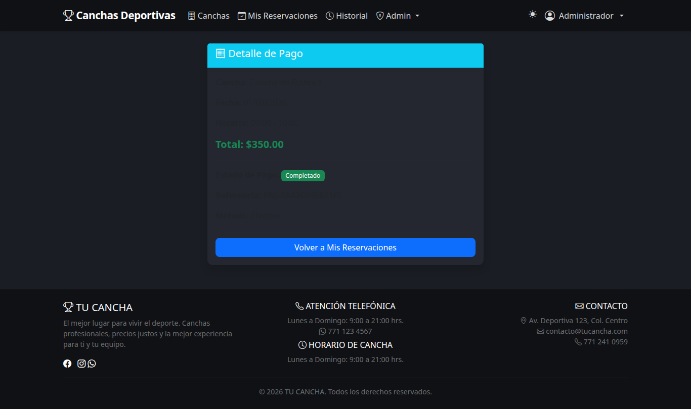

### 6.5 Gestión de reservaciones del cliente

El usuario puede ver sus reservaciones activas, pagar las pendientes, cancelar reservaciones, y consultar su historial completo con información de pago:

```php
// pages/mis_reservaciones.php — Listado de reservaciones del usuario
$reservaciones = $reservacionModel->obtenerPorUsuario($_SESSION['usuario_id']);

// Cada fila:
// - "Pagar" si está pendiente
// - "Ver Pago" si está confirmada
// - "Cancelar" con confirmación JS
<?php if ($r['estado'] === 'pendiente'): ?>
<a href="pago.php?reservacion_id=<?php echo $r['id']; ?>" class="btn btn-success btn-sm">
    <i class="bi bi-credit-card"></i> Pagar
</a>
<?php endif; ?>
```

**Evidencia:**

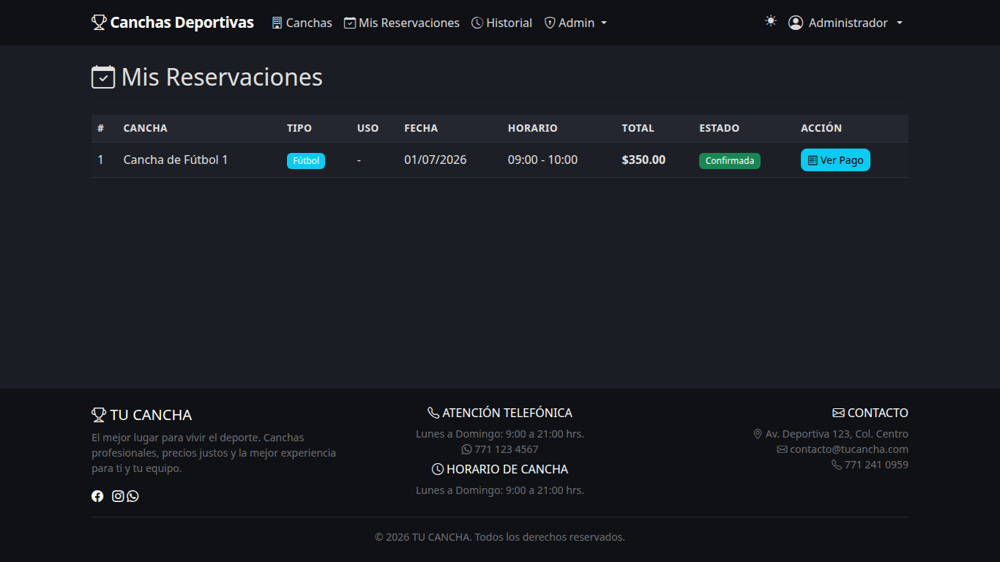

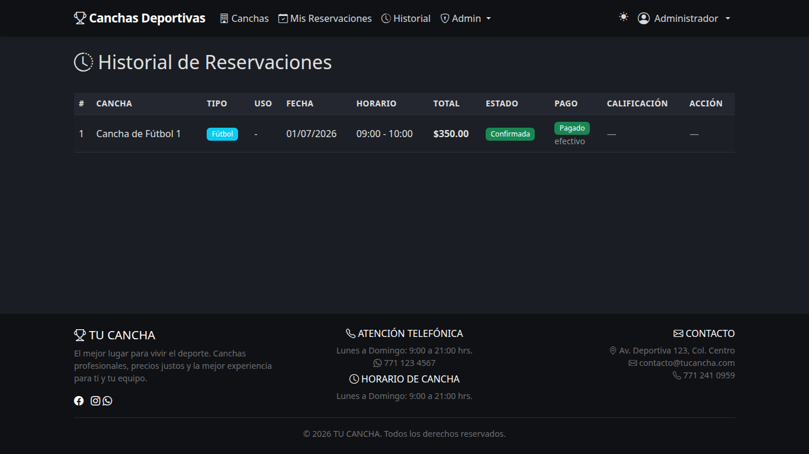

### 6.6 Calificaciones y reseñas

Las reseñas se habilitan únicamente para reservaciones en estado `completada`. Cada reservación puede tener máximo una reseña. El modal de calificación usa estrellas interactivas:

```php
// pages/historial.php — Modal de calificación
<div class="rating-stars mb-2">
    <?php for ($i = 1; $i <= 5; $i++): ?>
        <i class="bi bi-star fs-3 text-warning" style="cursor:pointer"
           data-value="<?php echo $i; ?>"
           onclick="seleccionarStar(this, <?php echo $i; ?>)"></i>
    <?php endfor; ?>
</div>
```

```javascript
// Función JS que actualiza visualmente las estrellas
function seleccionarStar(el, value) {
    const container = el.parentElement;
    container.querySelectorAll('i').forEach(function(star, idx) {
        star.className = idx < value
            ? 'bi bi-star-fill fs-3 text-warning'
            : 'bi bi-star fs-3 text-warning';
    });
    container.parentElement.querySelector('input[name="puntuacion"]').value = value;
}
```

**Evidencia:**

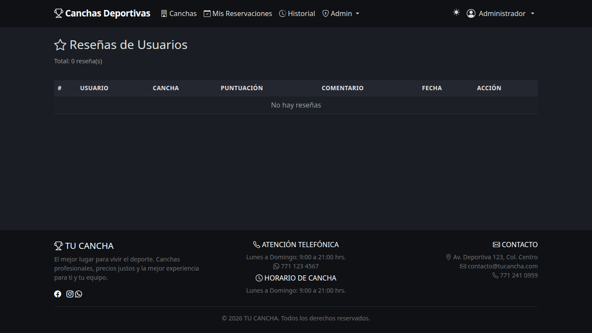

### 6.7 Perfil de usuario y auto-eliminación

El perfil permite editar datos personales, cambiar foto, actualizar contraseña, y solicitar la eliminación de la cuenta. La auto-eliminación programada se ejecuta mediante el CRON:

```php
// classes/Usuario.php — Auto-eliminación de cuentas
public function autoEliminarCuentas($diasInactividad = 90, $diasSolicitud = 30)
{
    $total = 0;

    // Cuentas con solicitud de eliminación vencida
    $sql = "DELETE FROM usuarios WHERE solicitud_eliminacion IS NOT NULL
            AND solicitud_eliminacion < DATE_SUB(NOW(), INTERVAL :dias DAY)
            AND rol = 'cliente'";
    $stmt = $this->db->prepare($sql);
    $stmt->execute([':dias' => $diasSolicitud]);
    $total += $stmt->rowCount();

    // Cuentas sin acceso por más de 90 días
    $sql = "DELETE FROM usuarios WHERE ultimo_acceso IS NOT NULL
            AND ultimo_acceso < DATE_SUB(NOW(), INTERVAL :dias DAY)
            AND rol = 'cliente'";
    $stmt = $this->db->prepare($sql);
    $stmt->execute([':dias' => $diasInactividad]);
    $total += $stmt->rowCount();

    return $total;
}
```

**Evidencia:**

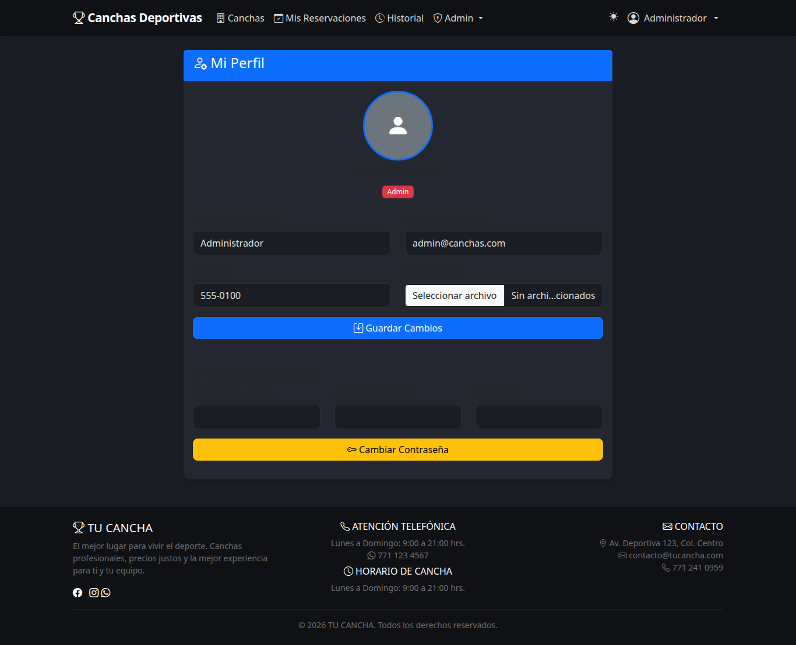

### 6.8 Panel de administración

#### Dashboard

El dashboard muestra tarjetas con estadísticas (total de canchas, reservaciones del mes, clientes registrados, ingresos del mes) y la bitácora de actividad reciente:

```php
// admin/index.php — Consulta de ingresos del mes
$stmtIngresos = $db->query("
    SELECT COALESCE(SUM(p.monto), 0)
    FROM pagos p
    JOIN reservaciones r ON p.reservacion_id = r.id
    WHERE p.estado_pago = 'completado'
      AND p.fecha_pago >= '" . date('Y-m-01') . "'
      AND p.fecha_pago <= '" . date('Y-m-t 23:59:59') . "'
");
$ingresosMes = $stmtIngresos->fetchColumn();
```

**Evidencia:**

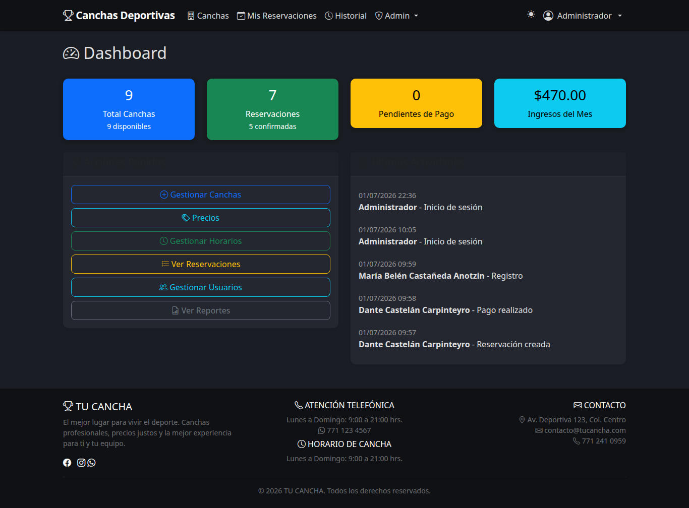

#### Gestión de canchas, precios y horarios

El administrador puede crear canchas (con generación automática de horarios y precios por defecto), gestionar precios diferenciados con modal de edición, y controlar la disponibilidad horaria por bloque individual:

```php
// admin/canchas.php — Creación de cancha + generación automática
if ($accion === 'crear') {
    $id = $canchaModel->crear($_POST);
    $horarioModel->generarHorarios($id, 1, '08:00', '22:00', 60);
    $precioModel->crear([
        'cancha_id' => $id,
        'tipo_precio' => 'regular',
        'nombre' => 'Precio regular',
        'precio' => $_POST['precio_por_hora']
    ]);
}
```

**Evidencia:**

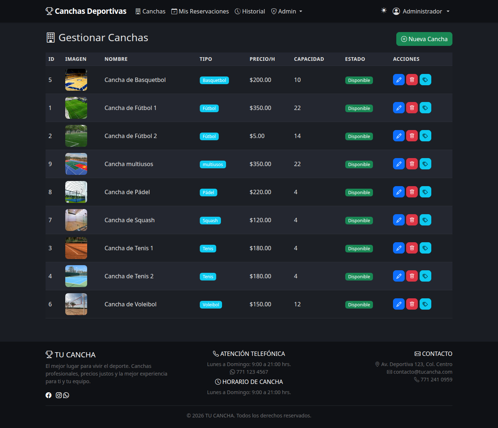

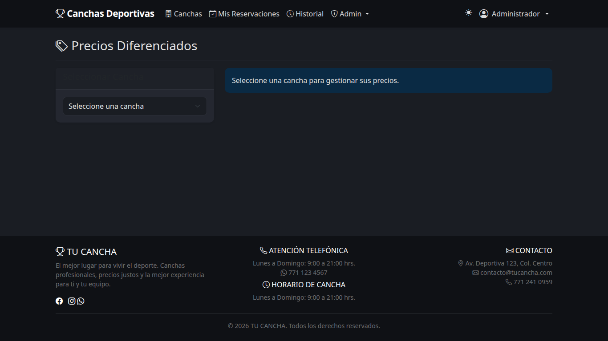

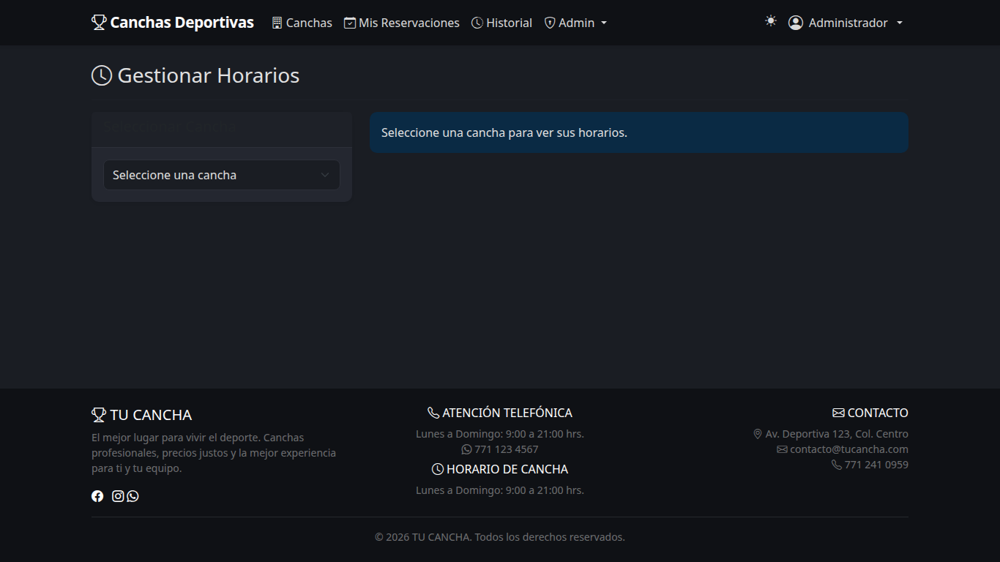

#### Reservaciones con paginación y filtros

Todas las reservaciones se muestran con paginación de 20 registros y filtros combinados por estado, cancha, rango de fechas y búsqueda textual:

```php
// classes/Reservacion.php — Método obtenerPaginas()
public function obtenerPaginas($pagina = 1, $porPagina = 20, $filtros = [])
{
    $where = [];
    $params = [];

    if (!empty($filtros['estado'])) {
        $where[] = "r.estado = :estado";
        $params[':estado'] = $filtros['estado'];
    }
    if (!empty($filtros['cancha_id'])) {
        $where[] = "r.cancha_id = :cancha_id";
        $params[':cancha_id'] = $filtros['cancha_id'];
    }
    if (!empty($filtros['fecha_desde'])) {
        $where[] = "r.fecha >= :fecha_desde";
        $params[':fecha_desde'] = $filtros['fecha_desde'];
    }
    if (!empty($filtros['fecha_hasta'])) {
        $where[] = "r.fecha <= :fecha_hasta";
        $params[':fecha_hasta'] = $filtros['fecha_hasta'];
    }
    // ... WHERE clause + COUNT(*) + LIMIT/OFFSET
}
```

**Evidencia:**

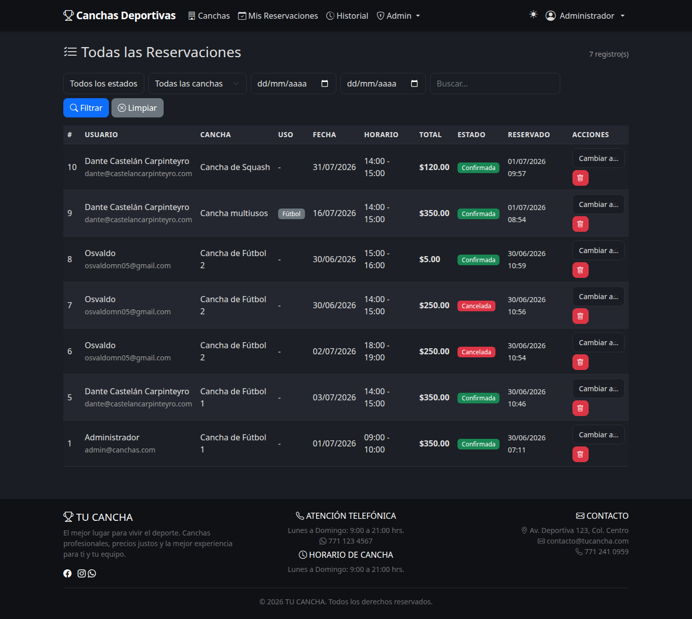

#### Usuarios con paginación

```php
// classes/Usuario.php — obtenerPaginas() es análogo,
// soporta filtros por: busqueda (nombre/email), rol, activo
$resultado = $usuarioModel->obtenerPaginas($pagina, $porPagina, $filtros);
// Retorna: ['datos', 'total', 'pagina', 'porPagina', 'totalPaginas']
```

**Evidencia:**

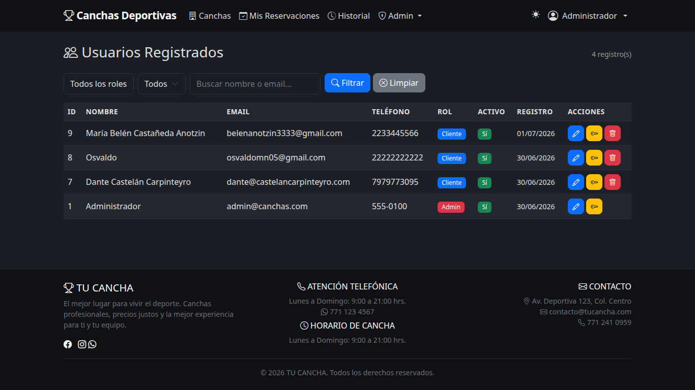

### 6.9 Reportes con Chart.js

El módulo de reportes procesa los datos por rango de fechas y cancha, y genera dos gráficas de barras con Chart.js: ingresos por día y reservaciones por día. Las gráficas se adaptan automáticamente al modo oscuro:

```php
// admin/reportes.php — Preparación de datos para Chart.js
$ingresosPorDia = [];
foreach ($reporteIngresos as $r) {
    $dia = $r['dia'];
    if (!isset($ingresosPorDia[$dia])) {
        $ingresosPorDia[$dia] = ['reservaciones' => 0, 'ingresos' => 0];
    }
    $ingresosPorDia[$dia]['reservaciones'] += (int)$r['total_reservaciones'];
    $ingresosPorDia[$dia]['ingresos'] += (float)$r['ingreso_total'];
}
ksort($ingresosPorDia);

$chartLabels = json_encode(array_keys($ingresosPorDia));
$chartReservas = json_encode(array_column($ingresosPorDia, 'reservaciones'));
$chartIngresos = json_encode(array_column($ingresosPorDia, 'ingresos'));
```

```javascript
// admin/reportes.php — Inicialización de Chart.js
new Chart(document.getElementById('chartIngresos'), {
    type: 'bar',
    data: {
        labels: dias,
        datasets: [{
            label: 'Ingresos ($)',
            data: <?php echo $chartIngresos; ?>,
            backgroundColor: 'rgba(25,135,84,0.7)',
            borderColor: 'rgba(25,135,84,1)',
            borderWidth: 1
        }]
    },
    options: {
        responsive: true,
        plugins: { legend: { labels: { color: textColor } } },
        scales: {
            x: { ticks: { color: textColor }, grid: { color: gridColor } },
            y: { ticks: { color: textColor, callback: function(v) { return '$' + v; } }, grid: { color: gridColor } }
        }
    }
});
```

**Evidencia:**

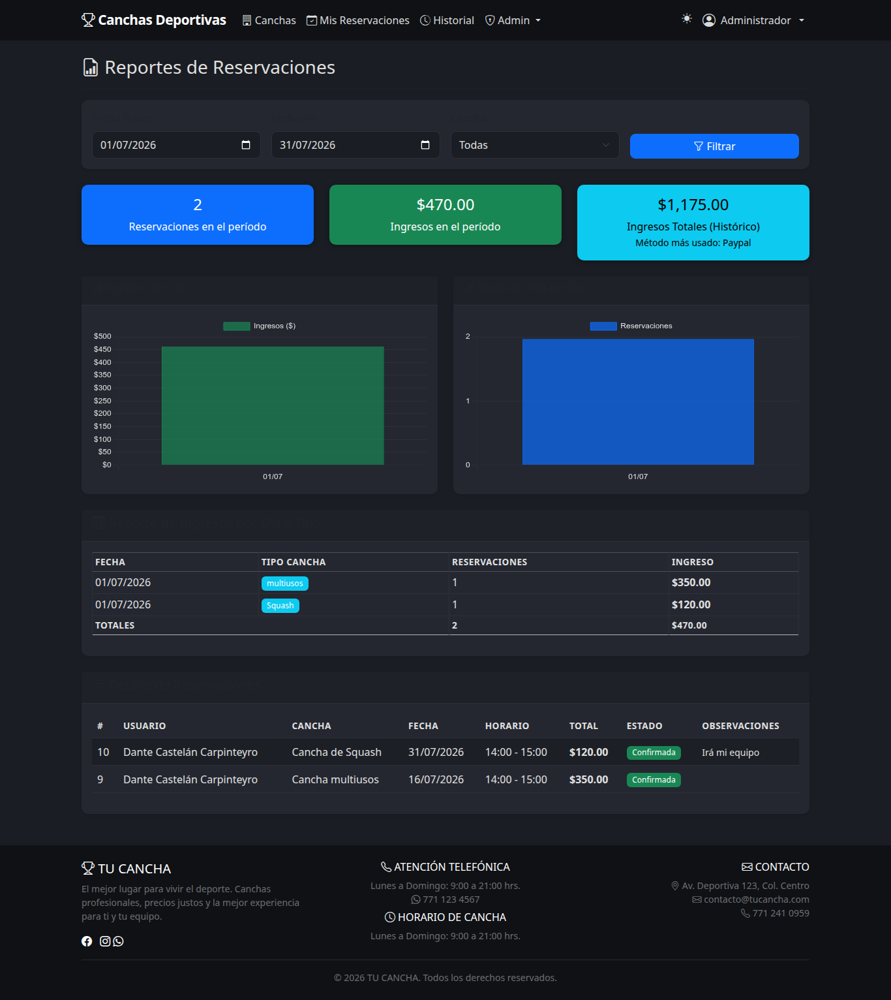

### 6.10 Días festivos

CRUD completo para gestionar fechas festivas y activarlas/desactivarlas con un toggle:

```php
// admin/festivos.php — Toggle de activo
<form method="POST" style="display:inline">
    <input type="hidden" name="accion" value="toggle">
    <input type="hidden" name="id" value="<?php echo $f['id']; ?>">
    <button type="submit" class="btn btn-sm <?php echo $f['activo'] ? 'btn-success' : 'btn-secondary'; ?>">
        <?php echo $f['activo'] ? 'Activo' : 'Inactivo'; ?>
    </button>
</form>
```

**Evidencia:**

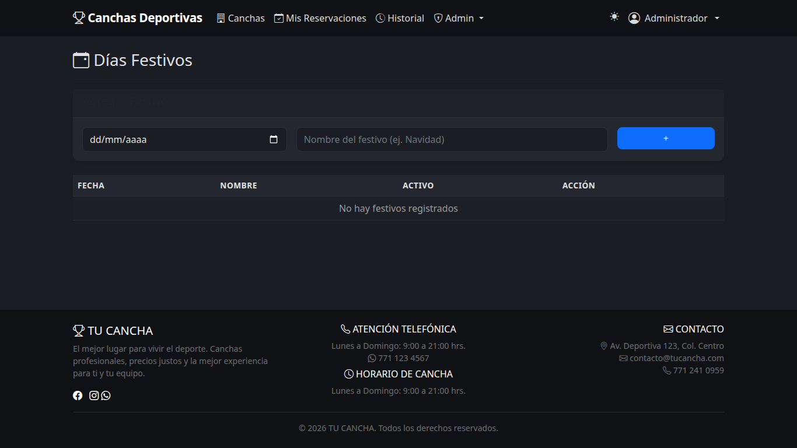

### 6.11 Sistema de correos (PHPMailer)

El sistema de notificaciones vía SMTP se implementó con PHPMailer, reemplazando la implementación previa con `fsockopen`. Cada método de `Mailer` construye un cuerpo HTML con plantilla responsiva:

```php
// classes/Mailer.php — Configuración SMTP
private function crearMailer()
{
    $mail = new PHPMailer(true);
    $mail->isSMTP();
    $mail->Host = MAIL_HOST;
    $mail->Port = MAIL_PORT;
    $mail->SMTPAuth = true;
    $mail->Username = MAIL_USER;
    $mail->Password = MAIL_PASS;
    $mail->CharSet = 'UTF-8';
    $mail->Encoding = 'base64';

    if (defined('MAIL_SMTP_SECURE') && MAIL_SMTP_SECURE === 'tls') {
        $mail->SMTPSecure = PHPMailer::ENCRYPTION_STARTTLS;
    }

    $mail->setFrom(MAIL_FROM, MAIL_FROM_NAME);
    $mail->isHTML(true);
    return $mail;
}
```

**Correos implementados:**
1. **bienvenida** — Al registrarse
2. **confirmacionReservacion** — Al pagar exitosamente
3. **nuevaReservacionAdmin** — Notifica al admin de una nueva reserva
4. **cancelacionReservacion** — Al cancelar una reservación
5. **recuperacionPassword** — Enlace de restablecimiento
6. **recordatorioReservacion** — 24h antes de la reserva (vía CRON)

### 6.12 Tareas programadas (CRON)

El script `admin/cron.php` ejecuta tres tareas:

| Tarea | Descripción | Frecuencia sugerida |
|-------|-------------|-------------------|
| Recordatorios 24h | Envía correo a usuarios con reservación al día siguiente | Cada hora |
| Auto-cancelar | Cancela reservaciones pendientes > 30 min sin pago | Cada hora |
| Auto-eliminar | Elimina cuentas inactivas 90d o solicitudes vencidas 30d | Cada hora |

```php
// admin/cron.php — Fragmento del recordatorio
$manana = date('Y-m-d', strtotime('+1 day'));
$stmt = $db->prepare("
    SELECT r.*, u.nombre AS usuario_nombre, u.email, c.nombre AS cancha_nombre
    FROM reservaciones r
    JOIN usuarios u ON r.usuario_id = u.id
    JOIN canchas c ON r.cancha_id = c.id
    WHERE r.fecha = :manana
      AND r.estado = 'confirmada'
      AND r.recordatorio_enviado = 0
");
$stmt->execute([':manana' => $manana]);
// Para cada una: enviar correo + marcar recordatorio_enviado = 1
```

### 6.13 Modo oscuro

El modo oscuro se activa mediante un botón en la barra de navegación. La preferencia se persiste en `localStorage` y respeta la preferencia del sistema (`prefers-color-scheme`). La clase `dark-mode` se aplica al `<html>` antes del primer pintado para evitar FOUC:

```javascript
// assets/js/dark-mode.js — Fragmento de inicialización
(function() {
    var STORAGE_KEY = 'dark-mode';
    var CLASS_NAME = 'dark-mode';

    function isDark() {
        try {
            var saved = localStorage.getItem(STORAGE_KEY);
            if (saved !== null) return saved === '1';
        } catch (e) {}
        return window.matchMedia('(prefers-color-scheme: dark)').matches;
    }

    document.documentElement.classList.toggle(CLASS_NAME, isDark());
})();
```

```html
<!-- includes/header.php — Script inline anti-FOUC -->
<script>
    (function(){
        try{
            var d=document.documentElement,
                c=d.classList,
                s=localStorage.getItem('dark-mode');
            c.toggle('dark-mode',
                s==='1'||(s===null&&window.matchMedia('(prefers-color-scheme:dark)').matches));
        }catch(e){}
    })();
</script>
```

**Evidencia:**

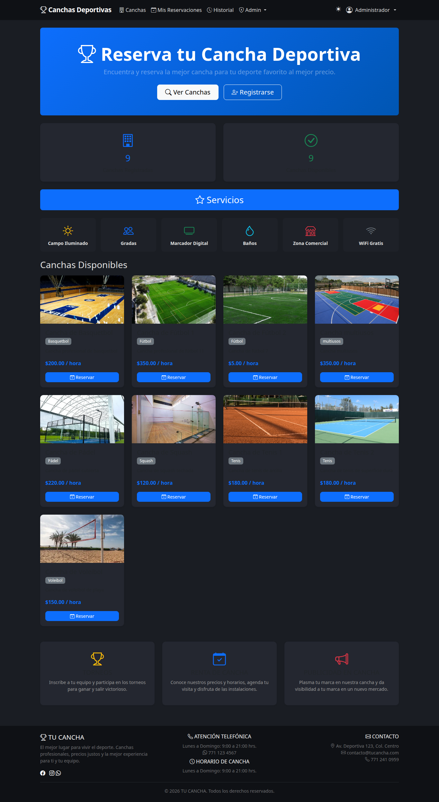

## 7. Reporte completo de cambios y nuevas funcionalidades

A continuación se listan todas las funcionalidades implementadas durante el desarrollo del proyecto, en el orden en que fueron completadas:

| # | Funcionalidad | Archivos clave |
|---|---------------|----------------|
| 1 | **Sistema de migraciones SQL** | `database/migrar.php`, `database/migraciones/*.sql` |
| 2 | **PHPMailer** | `classes/Mailer.php`, `composer.json` |
| 3 | **Modo oscuro** | `assets/css/dark-mode.css`, `assets/js/dark-mode.js`, `includes/header.php`, `includes/navbar.php` |
| 4 | **CRON** (recordatorios, auto-cancelación, auto-eliminación) | `admin/cron.php`, `classes/Usuario.php`, `database/migraciones/004_recordatorio_enviado.sql` |
| 5 | **Paginación + filtros** en admin | `admin/reservaciones.php`, `admin/usuarios.php`, `classes/Reservacion.php`, `classes/Usuario.php` |
| 6 | **Auto-eliminación de cuenta** | `classes/Usuario.php`, `pages/perfil.php`, `api/perfil.php`, `database/migraciones/005_ultimo_acceso.sql` |
| 7 | **Panel de cliente mejorado** | `pages/perfil.php`, `api/perfil.php` |
| 8 | **Reseñas y calificación** | `classes/Resena.php`, `api/resena.php`, `admin/resenas.php`, `pages/historial.php`, `pages/canchas.php`, `database/migraciones/003_resenas.sql` |
| 9 | **Gráficas con Chart.js** | `admin/reportes.php` |
| 10 | **Festivos** | `admin/festivos.php`, `database/migraciones/002_festivos.sql` |
| 11 | **Correo de bienvenida** (restaurado) | `api/registro.php` |
| 12 | **PayPal** (crear/capturar orden) | `classes/PayPal.php`, `api/paypal_create_order.php`, `api/paypal_capture_order.php`, `pages/pago.php` |

## 8. Conclusión

El proyecto "TU CANCHA" se desarrolló como una aplicación web completa de reservación de canchas deportivas, implementando desde la autenticación de usuarios hasta un panel administrativo con capacidades de gestión avanzada.

Las decisiones técnicas clave incluyeron:

1. **PHP nativo sin framework** — Se priorizó el control total sobre la arquitectura y la ausencia de dependencias pesadas.
2. **PHPMailer vía SMTP** — Se reemplazó la implementación manual con `fsockopen` por PHPMailer, que ofrece mejor manejo de errores, TLS nativo y codificación de attachments.
3. **Migraciones SQL versionadas** — Se implementó un gestor de migraciones casero para aplicar cambios de esquema de forma ordenada y reproducible.
4. **Paginación en base de datos** — Se movió la paginación del lado de PHP (`array_slice`) a SQL (`LIMIT/OFFSET`) para eficiencia con grandes volúmenes de datos.
5. **PayPal REST API** — Integración cliente-servidor: el frontend usa el JS SDK para la aprobación y el backend captura mediante cURL con OAuth2.
6. **Chart.js para reportes** — Se agregaron gráficas de barras que se adaptan al modo oscuro del sistema.
7. **Arquitectura orientada a objetos** — Cada entidad de negocio tiene una clase con métodos CRUD y consultas específicas, todas usando PDO con sentencias preparadas.

El sistema queda funcional en producción en `https://preview.castelancarpinteyro.com` y está listo para su uso real. Las futuras mejoras podrían incluir:
- Autenticación multifactor
- Notificaciones SMS vía API
- Panel de clientes con más estadísticas personales
- Exportación de reportes a PDF/Excel
- Pasarela de pago con tarjeta directa ( Stripe / Conekta )
