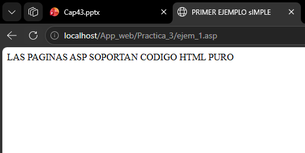
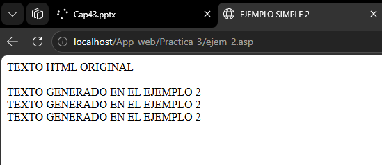
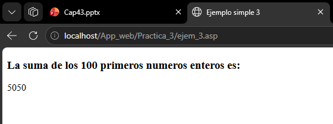
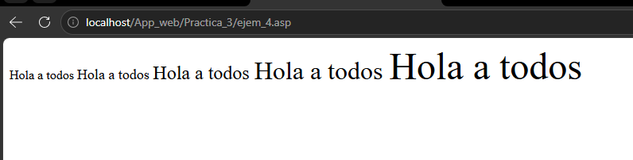
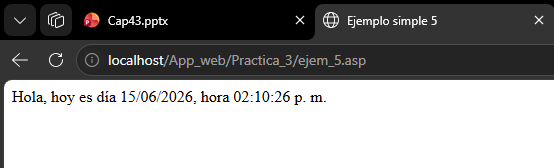
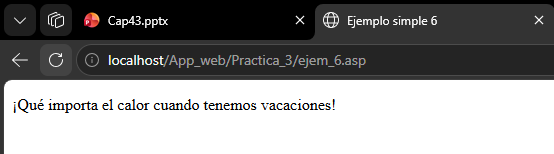
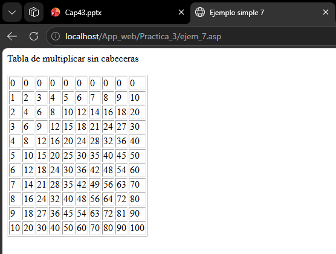

# Reporte - Práctica 3: Active Server Pages (ASP) Clásico

---

**ASIGNATURA:**  
Desarrollo de Aplicaciones Web

**DOCENTE:**  
EUGENIA ERICA VERA CERVANTES

**ALUMNO:**  
MONTEALEGRE NAHUACATL, OSVALDO 

**FECHA DE ENTREGA:**  
Lunes, 15 de junio de 2026

---


## Introducción

Active Server Pages (ASP) es una tecnología de scripting del lado del servidor desarrollada por Microsoft que permite generar contenido web dinámico. Los archivos con extensión `.asp` se procesan en el servidor web (IIS — Internet Information Services) antes de enviar el resultado HTML al navegador del cliente.

En esta práctica se exploraron los fundamentos de ASP Clásico (VBScript) mediante siete ejemplos progresivos que abarcan desde la inserción de HTML puro hasta la generación dinámica de tablas con bucles anidados. Cada ejemplo cuenta con su correspondiente archivo `.html` estático que muestra el resultado final que el servidor entregaría al cliente, permitiendo contrastar el código fuente ASP con su salida renderizada.

El objetivo principal es comprender cómo el servidor ejecuta bloques de código delimitados por `<% ... %>` y `<% = expresion %>`, sustituyéndolos por el resultado de su evaluación antes de enviar la respuesta al navegador.

---

## Entorno y requisitos

Para visualizar y ejecutar correctamente los archivos de esta práctica se requiere lo siguiente:

- **Sistema operativo:** Windows 10/11 o Windows Server con IIS (Internet Information Services) instalado y habilitado.
- **IIS con ASP Clásico:** El rol de servidor web debe tener habilitado ASP (Active Server Pages) en las características de IIS.
- **Navegador web:** Cualquier navegador moderno (Chrome, Edge, Firefox) para solicitar las páginas ASP a través de HTTP.
- **Ubicación de los archivos:** Los archivos `.asp` y `.html` deben colocarse en el directorio raíz del sitio web (por defecto `C:\inetpub\wwwroot\`) o en una subcarpeta dentro de este.
- **Permisos:** El directorio del sitio debe tener permisos de lectura para el usuario `IUSR` (IIS Anonymous User).
- **Editor de código:** Recomendable usar un editor como VS Code, Notepad++ o Bloc de notas para revisar y modificar el código fuente.

---

## Ejecución

Para ejecutar los ejemplos de esta práctica siga estos pasos:

1. Asegúrese de que IIS esté instalado y en ejecución en su equipo Windows.
2. Copie todos los archivos `.asp` y `.html` de la práctica al directorio raíz del sitio web (`C:\inetpub\wwwroot\App_web\`).
3. Abra un navegador web y acceda a la siguiente URL:
   - `http://localhost/App_web/ejem_1.asp` (para el primer ejemplo)
   - Cambie el número del archivo para acceder a los demás ejemplos (ejem_2.asp, ejem_3.asp, ..., ejem_7.asp).
4. Para ver el resultado HTML estático, abra directamente los archivos `.html` correspondientes desde el navegador o desde el explorador de archivos.
5. Si desea modificar algún ejemplo, edite el archivo `.asp` correspondiente con un editor de texto y guarde los cambios; luego recargue la página en el navegador para ver el resultado actualizado.

---

## Ejemplo 1: HTML puro en ASP

**Archivo:** `ejem_1.asp`

El ejemplo más básico: una página ASP que contiene únicamente HTML puro. Esto demuestra que ASP es compatible con HTML estándar y que cualquier contenido fuera de los delimitadores `<% %>` se envía directamente al cliente sin modificación.

```asp
<!DOCTYPE html>
<html lang="en">
<head>
    <meta charset="UTF-8">
    <meta name="viewport" content="width=device-width, initial-scale=1.0">
    <title>PRIMER EJEMPLO sIMPLE</title>
</head>
<body>
    LAS PAGINAS ASP SOPORTAN CODIGO HTML PURO
</body>
</html>
```

**Salida:** El navegador recibe exactamente el mismo código HTML, mostrando el mensaje "LAS PAGINAS ASP SOPORTAN CODIGO HTML PURO".

---

## Ejemplo 2: Ciclo FOR...NEXT en ASP

**Archivo:** `ejem_2.asp`

Se introduce el bucle `FOR...NEXT` de VBScript. El bloque de código dentro de `<% ... %>` se ejecuta en el servidor, repitiendo el texto "TEXTO GENERADO EN EL EJEMPLO 2" tres veces.

```asp
<!DOCTYPE html>
<html lang="en">
<head>
    <meta charset="UTF-8">
    <meta name="viewport" content="width=device-width, initial-scale=1.0">
    <title>EJEMPLO SIMPLE 2</title>
</head>
<body>
    TEXTO HTML ORIGINAL 
    <BR>
    <BR>
    <% FOR I = 1 TO 3 %>
    TEXTO GENERADO EN EL EJEMPLO 2
    <BR>
    <% NEXT %>
</body>
</html>
```

**Archivo de salida:** `ejem_2.html`

```html
<!DOCTYPE html>
<html lang="en">
<head>
    <meta charset="UTF-8">
    <meta name="viewport" content="width=device-width, initial-scale=1.0">
    <title>Ejemplo simple 2</title>
</head>
<body>
    Texto HTML orginal <br><br>
    Texto generado en el ejemplo 2<br>
    Texto generado en el ejemplo 2<br>
    Texto generado en el ejemplo 2<br>
</body>
</html>
```

**Explicación:** El servidor ejecuta el bucle `FOR I = 1 TO 3`, generando tres líneas del texto. El navegador nunca ve el código ASP, solo recibe el HTML resultante con las tres repeticiones.

---

## Ejemplo 3: Suma acumulativa con ASP

**Archivo:** `ejem_3.asp`

Se utiliza un bucle `FOR...NEXT` para sumar los primeros 100 números enteros. El resultado se imprime con la sintaxis `<% = expresion %>`.

```asp
<!DOCTYPE html>
<html lang="en">
<head>
    <meta charset="UTF-8">
    <meta name="viewport" content="width=device-width, initial-scale=1.0">
    <title>Ejemplo simple 3</title>
</head>
<body>
    <h3>La suma de los 100 primeros numeros enteros es: </h3>

    <% Acumulador = 0 
    for Indice = 1 to 100
    Acumulador = Acumulador + Indice 
    next %>
    <% = Acumulador %>
</body>
</html>
```

**Archivo de salida:** `ejem_3.html`

```html
<!DOCTYPE html>
<html lang="en">
<head>
    <meta charset="UTF-8">
    <meta name="viewport" content="width=device-width, initial-scale=1.0">
    <title>Ejemplo simple 3</title>
</head>
<body>
    La suma de los 100 primeros numeros enteros es: 
    5050
</body>
</html>
```

**Explicación:** La variable `Acumulador` se inicializa en 0 y se incrementa con cada valor de `Indice` del 1 al 100. Al final, `<% = Acumulador %>` imprime 5050, que es la suma de los primeros 100 números naturales: (100 × 101) / 2 = 5050.

---

## Ejemplo 4: Tamaño dinámico de fuente

**Archivo:** `ejem_4.asp`

Demostración de cómo ASP puede modificar dinámicamente atributos HTML, en este caso el tamaño de la fuente mediante un bucle.

```asp
<!DOCTYPE html>
<html lang="en">
<head>
    <meta charset="UTF-8">
    <meta name="viewport" content="width=device-width, initial-scale=1.0">
    <title>Ejemplo simple 4</title>
</head>
<body>
    <% for i = 3 to 7 %>
    <FONT SIZE = <% = i %>> Hola a todos 
    </FONT>
    <% next %>
</body>
</html>
```

**Archivo de salida:** `ejem_4.html`

```html
<!DOCTYPE html>
<html lang="en">
<head>
    <meta charset="UTF-8">
    <meta name="viewport" content="width=device-width, initial-scale=1.0">
    <title>Ejemplo simple 4</title>
</head>
<body>
    FONT SIZE=3>Hola a todos
	</FONT><BR>lugar a problem
	<FONT SIZE=4>Hola a todos
	</FONT> <BR>
	<FONT SIZE=5>Hola a todos
	</FONT> <BR>
	<FONT SIZE=6>Hola a todos
	</FONT> <BR>
	<FONT SIZE=7>Hola a todos
	</FONT> <BR>
</body>
</html>
```

**Explicación:** El bucle `FOR i = 3 TO 7` genera cinco etiquetas `<FONT>` con tamaños del 3 al 7. La expresión `<% = i %>` se evalúa en cada iteración, produciendo un tamaño de fuente distinto. Esto permite generar HTML dinámico sin escribir manualmente cada etiqueta.

---

## Ejemplo 5: Fecha y hora del servidor

**Archivo:** `ejem_5.asp`

Uso de las funciones intrínsecas de VBScript `Date` y `Time` para mostrar la fecha y hora actual del servidor.

```asp
<!DOCTYPE html>
<html lang="en">
<head>
    <meta charset="UTF-8">
    <meta name="viewport" content="width=device-width, initial-scale=1.0">
    <title>Ejemplo simple 5</title>
</head>
<body>
    <%="Hola, hoy es día " & date & ", hora " & Time %>
</body>
</html>
```

**Explicación:** La sintaxis `<%="texto" %>` es una abreviatura de `<% Response.Write("texto") %>`. Se concatenan cadenas con el operador `&` y se invocan las funciones `Date()` y `Time()` del servidor. Cada vez que se solicita la página, se muestra la fecha y hora actualizadas, demostrando el contenido dinámico en tiempo real.

---

## Ejemplo 6: Condicional IF...THEN...ELSE

**Archivo:** `ejem_6.asp`

Introducción de la lógica condicional con `IF...THEN...ELSE...END IF` para mostrar un mensaje diferente según el mes actual.

```asp
<!DOCTYPE html>
<html lang="en">
<head>
    <meta charset="UTF-8">
    <meta name="viewport" content="width=device-width, initial-scale=1.0">
    <title>Ejemplo simple 6</title>
</head>
<body>
    <% mes = Month(Date)
    If (mes=7) Or (mes=8) Then
        Texto= "Aquí en México, donde está el equipo servidor, hace mucho calor en verano"
    Else
        Texto= "¡Qué importa el calor cuando tenemos vacaciones!"
    End If %>
    <p><% = Texto %></p>
</body>
</html>
```

**Archivo de salida:** `ejem_6.html`

```html
<!DOCTYPE html>
<html lang="en">
<head>
    <meta charset="UTF-8">
    <meta name="viewport" content="width=device-width, initial-scale=1.0">
    <title>Ejemplo simple 6</title>
</head>
<body>
    ¡Qué importa el calor cuando tenemos
    vacaciones!
</body>
</html>
```

**Explicación:** La función `Month(Date)` devuelve el número del mes actual (1–12). Si es julio (7) u agosto (8), se asigna un mensaje sobre el calor; de lo contrario, se asigna otro mensaje. En este caso, como el reporte se genera en junio (mes 6), se ejecuta la rama `Else`, mostrando "¡Qué importa el calor cuando tenemos vacaciones!".

---

## Ejemplo 7: Tabla de multiplicar con bucles anidados

**Archivo:** `ejem_7.asp`

Uso de bucles `FOR...NEXT` anidados para generar dinámicamente una tabla de multiplicar del 1 al 10.

```asp
<!DOCTYPE html>
<html lang="en">
<head>
    <meta charset="UTF-8">
    <meta name="viewport" content="width=device-width, initial-scale=1.0">
    <title>Ejemplo simple 7</title>
</head>
<body>
    Tabla de multiplicar sin cabeceras<BR> <BR>
    <TABLE BORDER="1" WIDTH="70">
    <% for i=1 to 10 %>
        <TR>
        <% for j=1 to 10 %>
            <TD> <% = j*i %> </TD>
        <% next %>
        </TR>
    <% next %>
    </TABLE>
</body>
</html>
```

**Archivo de salida:** `ejem_7.html` (134 líneas con la tabla completa)

```html
<!DOCTYPE html>
<html lang="en">
<head>
    <meta charset="UTF-8">
    <meta name="viewport" content="width=device-width, initial-scale=1.0">
    <title>Ejemplo simple 7</title>
</head>
<body>
    Tabla de multiplicar sin cabeceras <BR><BR>
    <TABLE BORDER = "1" Width = "70">
    <TR>
    <TD>1</TD>
    <TD>2</TD>
    <TD>3</TD>
    ... (10 filas × 10 columnas)
    </TABLE>
</body>
</html>
```

**Explicación:** El bucle exterior `FOR i = 1 TO 10` genera las filas (`<TR>`), mientras que el bucle interior `FOR j = 1 TO 10` genera las celdas (`<TD>`) con el producto `j * i`. Esto genera 100 celdas sin necesidad de escribirlas manualmente, demostrando el poder de los bucles anidados en la generación dinámica de contenido HTML.

---

## Pruebas de ejecución

A continuación se presentan las capturas de pantalla que muestran la ejecución de cada ejemplo en el navegador. (Agregue aquí las imágenes de los resultados obtenidos al ejecutar los archivos `.asp` en el servidor IIS).

### Ejemplo 1 — HTML puro en ASP


### Ejemplo 2 — Ciclo FOR...NEXT


### Ejemplo 3 — Suma acumulativa


### Ejemplo 4 — Tamaño dinámico de fuente


### Ejemplo 5 — Fecha y hora del servidor


### Ejemplo 6 — Condicional IF...THEN...ELSE


### Ejemplo 7 — Tabla de multiplicar


---

## Comparativa ASP vs HTML estático

| Aspecto | ASP (`.asp`) | HTML estático (`.html`) |
|---------|-------------|------------------------|
| Procesamiento | Se ejecuta en el servidor (IIS) | Se envía directamente al cliente |
| Contenido dinámico | Soporta variables, bucles y condicionales | Contenido fijo |
| Actualización | Se actualiza automáticamente (fecha, hora, datos) | Requiere edición manual |
| Sintaxis adicional | Bloques `<% %>` y `<% = %>` | Solo etiquetas HTML |
| Seguridad | El código fuente no es visible para el cliente | El código completo es visible |

La principal ventaja de ASP es que permite generar páginas web cuyo contenido puede variar según la lógica del servidor, la fecha, la hora, datos de una base de datos o la interacción del usuario, sin necesidad de actualizar manualmente los archivos HTML.


